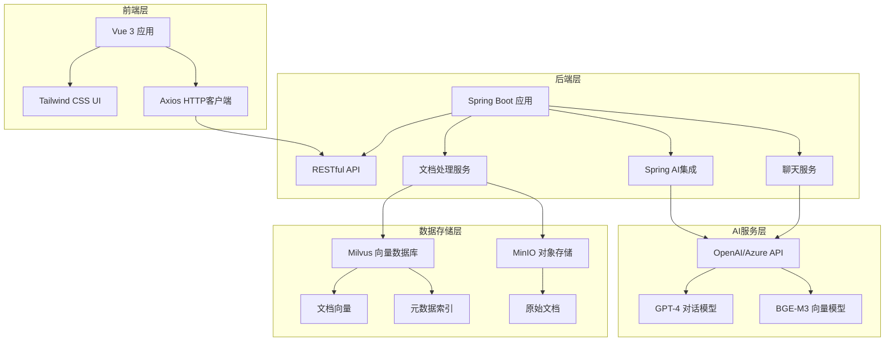
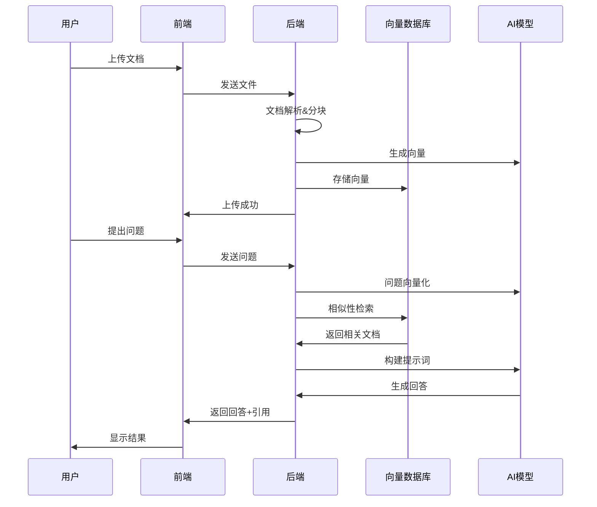

# KnowBase - 智能知识库问答系统

> 🚀 基于 RAG（检索增强生成）技术的企业级知识库系统，让您的文档"活"起来！

[](https://spring.io/projects/spring-boot)
[](https://vuejs.org/)
[](https://milvus.io/)
[](LICENSE)

---

## 📖 项目简介

KnowBase 是一个现代化的智能知识库问答系统，通过先进的 RAG（Retrieval-Augmented Generation）技术，将企业的文档、资料转化为可对话的智能助手。系统能够理解用户的自然语言问题，从知识库中检索相关信息，并生成准确、有引用来源的回答。

### 🎯 核心价值
- **智能问答**：基于您的文档内容，提供准确的AI问答服务
- **知识管理**：统一管理企业文档，提升知识利用效率
- **引用溯源**：每个回答都标注引用来源，确保信息可追溯
- **易于部署**：Docker一键部署，快速搭建企业知识库

---

## ✨ 功能特点

### 🧠 智能对话
- **自然语言理解**：支持中英文自然语言问答
- **上下文感知**：理解对话上下文，提供连贯回复
- **引用标注**：自动标注回答的文档来源和片段位置
- **实时响应**：毫秒级检索，快速生成回答

### 📄 文档管理
- **多格式支持**：PDF、DOC、DOCX、TXT、MD等常见格式
- **智能分块**：自动将长文档切分为语义相关的片段
- **向量化存储**：使用先进的向量数据库技术存储文档
- **批量上传**：支持多文件同时上传处理

### 🎨 用户体验
- **现代化界面**：基于Vue 3 + Tailwind CSS的响应式设计
- **实时反馈**：上传进度、处理状态实时显示
- **移动端适配**：完美支持手机、平板等移动设备
- **智能通知**：优雅的全局通知提示系统

### 🔧 技术特性
- **模块化架构**：前后端分离，组件化设计
- **高性能检索**：基于Milvus向量数据库的毫秒级检索
- **可扩展性**：支持多种LLM模型（OpenAI、Azure、本地模型）
- **容器化部署**：Docker + Docker Compose 一键部署

---

## 🏗️ 系统架构

### 整体架构图


### RAG工作流程


---

## 🛠️ 技术栈

| 分层 | 技术 | 版本 | 用途 |
|------|------|------|------|
| **前端** | Vue.js | 3.5.0 | 前端框架 |
| | Tailwind CSS | 3.3.6 | UI样式框架 |
| | Vite | 6.2.4 | 构建工具 |
| | Axios | 1.6.2 | HTTP客户端 |
| **后端** | Spring Boot | 3.5.0 | 后端框架 |
| | Spring AI | 1.0.0 | AI集成框架 |
| | Java | 17+ | 编程语言 |
| **AI服务** | OpenAI API | GPT-4 | 对话生成 |
| | BGE-M3 | - | 文本向量化 |
| **数据库** | Milvus | 2.5.1 | 向量数据库 |
| | MinIO | - | 对象存储 |
| | etcd | 3.5.5 | 配置管理 |
| **部署** | Docker | - | 容器化 |
| | Docker Compose | - | 容器编排 |

---

## 🚀 快速开始

### 环境要求
- **Java**: 17 或更高版本
- **Node.js**: 18 或更高版本
- **Docker**: 最新版本
- **Docker Compose**: 最新版本
- **内存**: 建议 8GB 以上

### 1️⃣ 克隆项目
```bash
git clone https://github.com/your-username/KnowBase.git
cd KnowBase
```

### 2️⃣ 启动向量数据库
```bash
# 启动 Milvus、MinIO、etcd 等基础服务
docker-compose up -d

# 检查服务状态
docker-compose ps
```

### 3️⃣ 配置后端
```bash
cd Backend

# 修改配置文件（重要！）
# 编辑 src/main/resources/application.yml
# 设置您的 OpenAI API Key 和其他配置
```

**配置示例：**
```yaml
spring:
  ai:
    openai:
      api-key: your-openai-api-key-here  # 必须设置
      base-url: https://api.openai.com   # 或其他兼容的API地址
      chat:
        options:
          model: gpt-4o
          temperature: 0.7
      embedding:
        options:
          model: text-embedding-3-large
```

### 4️⃣ 启动后端服务
```bash
# 方式1: 使用Maven
./mvnw spring-boot:run

# 方式2: 使用IDE
# 在IDE中运行 BackendApplication.java

# 验证后端启动
curl http://localhost:8080/api/health
```

### 5️⃣ 启动前端应用
```bash
cd ../fontback

# 安装依赖
npm install
# 或
yarn install

# 启动开发服务器
npm run dev
# 或
yarn dev
```

### 6️⃣ 访问应用
打开浏览器访问：http://localhost:5173

---

## ⚙️ 详细配置

### 后端配置 (application.yml)

```yaml
spring:
  ai:
    openai:
      api-key: ${OPENAI_API_KEY:your-api-key}  # 环境变量优先
      base-url: ${OPENAI_BASE_URL:https://api.openai.com}
      chat:
        options:
          model: gpt-4o                    # 对话模型
          temperature: 0.7                 # 创造性参数
          max-tokens: 2000                 # 最大输出长度
      embedding:
        options:
          model: text-embedding-3-large    # 向量模型
          
    vectorstore:
      milvus:
        client:
          host: ${MILVUS_HOST:localhost}   # Milvus地址
          port: ${MILVUS_PORT:19530}       # Milvus端口
        database-name: default
        collection-name: document_chunks   # 集合名称
        embedding-dimension: 3072          # 向量维度
        index-type: IVF_FLAT              # 索引类型
        metric-type: COSINE               # 相似度计算方式
        initialize-schema: true           # 自动初始化

  servlet:
    multipart:
      max-file-size: 50MB                 # 单文件大小限制
      max-request-size: 50MB              # 请求大小限制

server:
  port: ${SERVER_PORT:8080}               # 服务端口

logging:
  level:
    org.springframework.ai: DEBUG         # AI组件日志级别
    org.example.backend: DEBUG            # 应用日志级别
```

### 环境变量配置
创建 `.env` 文件：
```bash
# AI服务配置
OPENAI_API_KEY=your-openai-api-key-here
OPENAI_BASE_URL=https://api.openai.com

# 数据库配置
MILVUS_HOST=localhost
MILVUS_PORT=19530

# 服务配置
SERVER_PORT=8080
```

---

## 📚 API 文档

### 健康检查
```http
GET /api/health
```
**响应示例：**
```json
{
  "status": "OK",
  "service": "KnowBase RAG System"
}
```

### 发送消息
```http
POST /api/chat/message
Content-Type: application/json

{
  "message": "什么是人工智能？"
}
```
**响应示例：**
```json
{
  "answer": "人工智能（AI）是计算机科学的一个分支...",
  "references": [
    "AI基础教程.pdf (片段 1)",
    "机器学习概论.docx (片段 3)"
  ]
}
```

### 上传文档
```http
POST /api/documents/upload
Content-Type: multipart/form-data

file: [文件内容]
```
**响应示例：**
```json
{
  "message": "文档 'AI基础教程.pdf' 上传成功，共处理 15 个文档块"
}
```

---

## 📁 项目结构

```
KnowBase/
├── Backend/                    # 后端服务
│   ├── src/main/java/org/example/backend/
│   │   ├── BackendApplication.java      # 应用入口
│   │   ├── config/
│   │   │   └── AIConfig.java           # AI配置
│   │   ├── controller/
│   │   │   └── ChatController.java     # REST控制器
│   │   ├── model/
│   │   │   ├── ChatRequest.java        # 请求模型
│   │   │   └── ChatResponse.java       # 响应模型
│   │   └── service/
│   │       ├── ChatService.java        # 聊天服务
│   │       └── DocumentService.java    # 文档服务
│   ├── src/main/resources/
│   │   └── application.yml             # 配置文件
│   └── pom.xml                         # Maven配置
├── fontback/                   # 前端应用
│   ├── src/
│   │   ├── components/
│   │   │   ├── ChatWindow.vue          # 聊天窗口
│   │   │   └── DocumentUpload.vue      # 文档上传
│   │   ├── services/
│   │   │   └── api.js                  # API客户端
│   │   ├── App.vue                     # 根组件
│   │   └── main.js                     # 应用入口
│   ├── package.json                    # 依赖配置
│   └── vite.config.js                  # 构建配置
├── docker-compose.yml          # Docker编排配置
└── README.md                   # 项目文档
```

---

## 🔧 使用指南

### 上传文档
1. **准备文档**：支持 PDF、DOC、DOCX、TXT、MD 等格式
2. **文件大小**：单个文件不超过 50MB
3. **上传方式**：
   - 拖拽文件到上传区域
   - 点击选择文件按钮
   - 支持多文件同时上传

### 智能问答
1. **提出问题**：在聊天框中输入您的问题
2. **等待回答**：AI会基于您的文档内容生成回答
3. **查看引用**：每个回答都会显示引用的文档来源
4. **继续对话**：支持多轮对话，保持上下文连贯

### 最佳实践
- **文档质量**：上传结构清晰、内容完整的文档
- **问题明确**：提出具体、明确的问题获得更好的回答
- **定期更新**：及时上传新文档，保持知识库最新
- **合理分类**：按主题或部门组织文档，便于管理

---

## 🐛 故障排除

### 常见问题

#### 1. 后端启动失败
**现象**: 后端服务无法启动
**解决方案**:
```bash
# 检查Java版本
java -version  # 需要17+

# 检查端口占用
lsof -i :8080  # macOS/Linux
netstat -ano | findstr :8080  # Windows

# 查看详细错误日志
./mvnw spring-boot:run -X
```

#### 2. Milvus连接失败
**现象**: 向量数据库连接超时
**解决方案**:
```bash
# 检查Milvus状态
docker-compose ps

# 重启Milvus服务
docker-compose restart milvus

# 检查网络连接
telnet localhost 19530
```

#### 3. OpenAI API调用失败
**现象**: AI回答生成失败
**解决方案**:
```bash
# 检查API Key是否正确
curl -H "Authorization: Bearer YOUR_API_KEY" \
     https://api.openai.com/v1/models

# 检查网络连接
ping api.openai.com

# 使用代理或替代API地址
# 在application.yml中设置base-url
```

#### 4. 前端无法连接后端
**现象**: 前端显示连接失败
**解决方案**:
```bash
# 检查后端服务状态
curl http://localhost:8080/api/health

# 检查CORS配置
# 确保ChatController中有@CrossOrigin注解

# 检查防火墙设置
# 确保8080端口可访问
```

#### 5. 文档上传失败
**现象**: 文件上传时出现错误
**解决方案**:
- 检查文件格式是否支持
- 确认文件大小不超过50MB
- 检查磁盘空间是否充足
- 查看后端日志获取详细错误信息


### 代码规范
- **Java**: 遵循Google Java Style Guide
- **Vue.js**: 遵循Vue.js官方风格指南
- **提交信息**: 使用Conventional Commits规范

---

## 📞 支持与反馈


### 社区资源
- [Spring AI文档](https://docs.spring.io/spring-ai/reference/)
- [Milvus文档](https://milvus.io/docs)
- [Vue.js指南](https://vuejs.org/guide/)

---

## 📄 许可证

本项目采用 [MIT许可证](LICENSE)。

```
MIT License

Copyright (c) 2024 KnowBase Contributors

Permission is hereby granted, free of charge, to any person obtaining a copy
of this software and associated documentation files (the "Software"), to deal
in the Software without restriction, including without limitation the rights
to use, copy, modify, merge, publish, distribute, sublicense, and/or sell
copies of the Software, and to permit persons to whom the Software is
furnished to do so, subject to the following conditions:

The above copyright notice and this permission notice shall be included in all
copies or substantial portions of the Software.

THE SOFTWARE IS PROVIDED "AS IS", WITHOUT WARRANTY OF ANY KIND, EXPRESS OR
IMPLIED, INCLUDING BUT NOT LIMITED TO THE WARRANTIES OF MERCHANTABILITY,
FITNESS FOR A PARTICULAR PURPOSE AND NONINFRINGEMENT. IN NO EVENT SHALL THE
AUTHORS OR COPYRIGHT HOLDERS BE LIABLE FOR ANY CLAIM, DAMAGES OR OTHER
LIABILITY, WHETHER IN AN ACTION OF CONTRACT, TORT OR OTHERWISE, ARISING FROM,
OUT OF OR IN CONNECTION WITH THE SOFTWARE OR THE USE OR OTHER DEALINGS IN THE
SOFTWARE.
```

---

## 🙏 致谢

感谢以下开源项目和技术：
- [Spring Boot](https://spring.io/projects/spring-boot) - 强大的Java应用框架
- [Spring AI](https://docs.spring.io/spring-ai/reference/) - AI集成框架
- [Vue.js](https://vuejs.org/) - 渐进式前端框架
- [Milvus](https://milvus.io/) - 高性能向量数据库
- [Tailwind CSS](https://tailwindcss.com/) - 实用优先的CSS框架
- [OpenAI](https://openai.com/) - 先进的AI模型服务

---

<div align="center">

**🌟 如果这个项目对您有帮助，请给个Star支持一下！**

Made with ❤️ by KnowBase Team

</div> 