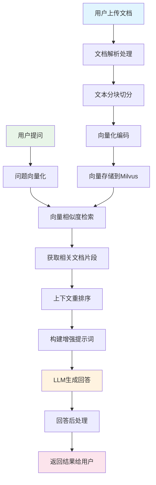

# RAG工作流程详解

## 📋 概述

本文档详细介绍KnowBase系统中RAG（Retrieval-Augmented Generation）的完整工作流程，包括文档处理、向量检索、上下文增强和答案生成的每个环节。

## 🔄 RAG整体流程



## 📄 文档处理阶段

### 1. 文档解析

#### 支持的文档格式
```java
public enum DocumentType {
    PDF("application/pdf", ".pdf"),
    DOCX("application/vnd.openxmlformats-officedocument.wordprocessingml.document", ".docx"),
    TXT("text/plain", ".txt"),
    MARKDOWN("text/markdown", ".md"),
    HTML("text/html", ".html");
    
    private final String mimeType;
    private final String extension;
}
```

#### 文档解析实现
```java
@Service
public class DocumentParserService {
    
    private final Map<DocumentType, DocumentParser> parsers;
    
    public DocumentParserService() {
        this.parsers = Map.of(
            DocumentType.PDF, new PdfDocumentParser(),
            DocumentType.DOCX, new DocxDocumentParser(),
            DocumentType.TXT, new TextDocumentParser(),
            DocumentType.MARKDOWN, new MarkdownDocumentParser()
        );
    }
    
    public ParsedDocument parseDocument(MultipartFile file) {
        DocumentType type = detectDocumentType(file);
        DocumentParser parser = parsers.get(type);
        
        if (parser == null) {
            throw new UnsupportedDocumentTypeException("不支持的文档类型: " + type);
        }
        
        try (InputStream inputStream = file.getInputStream()) {
            return parser.parse(inputStream, file.getOriginalFilename());
        } catch (Exception e) {
            throw new DocumentParseException("文档解析失败", e);
        }
    }
}

// PDF解析器实现
@Component
public class PdfDocumentParser implements DocumentParser {
    
    @Override
    public ParsedDocument parse(InputStream inputStream, String fileName) {
        try (PDDocument document = PDDocument.load(inputStream)) {
            PDFTextStripper stripper = new PDFTextStripper();
            
            // 设置解析选项
            stripper.setSortByPosition(true);
            stripper.setStartPage(1);
            stripper.setEndPage(document.getNumberOfPages());
            
            String content = stripper.getText(document);
            
            // 提取元数据
            PDDocumentInformation info = document.getDocumentInformation();
            Map<String, Object> metadata = extractMetadata(info);
            
            return ParsedDocument.builder()
                .fileName(fileName)
                .content(cleanContent(content))
                .pageCount(document.getNumberOfPages())
                .metadata(metadata)
                .build();
                
        } catch (IOException e) {
            throw new DocumentParseException("PDF解析失败", e);
        }
    }
    
    private String cleanContent(String content) {
        return content
            .replaceAll("\\r\\n|\\r|\\n", "\n")  // 统一换行符
            .replaceAll("\\s+", " ")             // 合并多个空格
            .trim();
    }
}
```

### 2. 文本分块策略

#### 智能分块算法
```java
@Service
public class TextChunkingService {
    
    private static final int DEFAULT_CHUNK_SIZE = 1000;
    private static final int DEFAULT_OVERLAP = 200;
    private static final Pattern SENTENCE_BOUNDARY = Pattern.compile("[.!?]+\\s+");
    private static final Pattern PARAGRAPH_BOUNDARY = Pattern.compile("\\n\\s*\\n");
    
    public List<DocumentChunk> chunkDocument(ParsedDocument document) {
        String content = document.getContent();
        
        // 选择分块策略
        ChunkingStrategy strategy = selectChunkingStrategy(document);
        
        return strategy.chunk(content, document.getMetadata());
    }
    
    private ChunkingStrategy selectChunkingStrategy(ParsedDocument document) {
        DocumentType type = document.getType();
        
        switch (type) {
            case MARKDOWN:
                return new MarkdownChunkingStrategy();
            case HTML:
                return new HtmlChunkingStrategy();
            default:
                return new SemanticChunkingStrategy();
        }
    }
}

// 语义分块策略
public class SemanticChunkingStrategy implements ChunkingStrategy {
    
    @Override
    public List<DocumentChunk> chunk(String content, Map<String, Object> metadata) {
        List<DocumentChunk> chunks = new ArrayList<>();
        
        // 1. 按段落分割
        String[] paragraphs = PARAGRAPH_BOUNDARY.split(content);
        
        StringBuilder currentChunk = new StringBuilder();
        int chunkIndex = 0;
        
        for (String paragraph : paragraphs) {
            // 2. 检查当前块大小
            if (currentChunk.length() + paragraph.length() > DEFAULT_CHUNK_SIZE) {
                if (currentChunk.length() > 0) {
                    chunks.add(createChunk(currentChunk.toString(), chunkIndex++, metadata));
                    
                    // 3. 保留重叠内容
                    currentChunk = new StringBuilder(getOverlapContent(currentChunk.toString()));
                }
            }
            
            currentChunk.append(paragraph).append("\n\n");
        }
        
        // 4. 处理最后一个块
        if (currentChunk.length() > 0) {
            chunks.add(createChunk(currentChunk.toString(), chunkIndex, metadata));
        }
        
        return chunks;
    }
    
    private String getOverlapContent(String content) {
        // 获取最后几句话作为重叠内容
        String[] sentences = SENTENCE_BOUNDARY.split(content);
        if (sentences.length <= 2) return "";
        
        int overlapLength = 0;
        StringBuilder overlap = new StringBuilder();
        
        for (int i = sentences.length - 1; i >= 0 && overlapLength < DEFAULT_OVERLAP; i--) {
            String sentence = sentences[i];
            if (overlapLength + sentence.length() <= DEFAULT_OVERLAP) {
                overlap.insert(0, sentence + ". ");
                overlapLength += sentence.length();
            }
        }
        
        return overlap.toString();
    }
    
    private DocumentChunk createChunk(String content, int index, Map<String, Object> metadata) {
        return DocumentChunk.builder()
            .content(content.trim())
            .chunkIndex(index)
            .chunkSize(content.length())
            .metadata(metadata)
            .createdAt(LocalDateTime.now())
            .build();
    }
}
```

### 3. 向量化处理

#### 嵌入服务实现
```java
@Service
public class EmbeddingService {
    
    private final EmbeddingClient embeddingClient;
    private final RedisTemplate<String, Object> redisTemplate;
    
    public EmbeddingService(EmbeddingClient embeddingClient, 
                           RedisTemplate<String, Object> redisTemplate) {
        this.embeddingClient = embeddingClient;
        this.redisTemplate = redisTemplate;
    }
    
    public float[] getEmbedding(String text) {
        // 1. 检查缓存
        String cacheKey = "embedding:" + DigestUtils.md5Hex(text);
        float[] cachedEmbedding = (float[]) redisTemplate.opsForValue().get(cacheKey);
        
        if (cachedEmbedding != null) {
            return cachedEmbedding;
        }
        
        // 2. 文本预处理
        String processedText = preprocessText(text);
        
        // 3. 调用嵌入模型
        try {
            EmbeddingResponse response = embeddingClient.embedForResponse(
                List.of(processedText));
            
            float[] embedding = response.getResults().get(0).getOutput();
            
            // 4. 缓存结果
            redisTemplate.opsForValue().set(cacheKey, embedding, Duration.ofHours(24));
            
            return embedding;
            
        } catch (Exception e) {
            log.error("向量化失败: {}", e.getMessage());
            throw new EmbeddingException("文本向量化失败", e);
        }
    }
    
    public List<float[]> getBatchEmbeddings(List<String> texts) {
        List<String> processedTexts = texts.stream()
            .map(this::preprocessText)
            .collect(Collectors.toList());
            
        try {
            EmbeddingResponse response = embeddingClient.embedForResponse(processedTexts);
            
            return response.getResults().stream()
                .map(result -> result.getOutput())
                .collect(Collectors.toList());
                
        } catch (Exception e) {
            log.error("批量向量化失败: {}", e.getMessage());
            throw new EmbeddingException("批量文本向量化失败", e);
        }
    }
    
    private String preprocessText(String text) {
        return text
            .trim()
            .replaceAll("\\s+", " ")           // 合并空格
            .replaceAll("[\\r\\n]+", " ")      // 移除换行
            .substring(0, Math.min(text.length(), 8000)); // 限制长度
    }
}
```

## 🔍 检索阶段

### 1. 向量检索实现

```java
@Service
public class VectorRetrievalService {
    
    private final MilvusServiceClient milvusClient;
    private final EmbeddingService embeddingService;
    
    public List<RetrievalResult> retrieveRelevantDocuments(String query, int topK) {
        try {
            // 1. 查询向量化
            float[] queryVector = embeddingService.getEmbedding(query);
            
            // 2. 构建检索参数
            SearchParam searchParam = buildSearchParam(queryVector, topK);
            
            // 3. 执行向量检索
            SearchResults results = milvusClient.search(searchParam);
            
            // 4. 处理检索结果
            return processSearchResults(results);
            
        } catch (Exception e) {
            log.error("向量检索失败", e);
            throw new RetrievalException("向量检索失败", e);
        }
    }
    
    private SearchParam buildSearchParam(float[] queryVector, int topK) {
        // 检索参数配置
        Map<String, Object> searchParams = new HashMap<>();
        searchParams.put("nprobe", 16);        // IVF参数
        searchParams.put("ef", 64);            // HNSW参数
        searchParams.put("radius", 0.1);       // 最小相似度阈值
        
        return SearchParam.newBuilder()
            .withCollectionName("documents")
            .withMetricType(MetricType.COSINE)
            .withOutFields(Arrays.asList(
                "content", "title", "document_id", 
                "chunk_index", "metadata"))
            .withTopK(topK)
            .withVectors(Collections.singletonList(queryVector))
            .withVectorFieldName("vector")
            .withParams(searchParams)
            .build();
    }
    
    private List<RetrievalResult> processSearchResults(SearchResults results) {
        List<RetrievalResult> retrievalResults = new ArrayList<>();
        
        for (SearchResult result : results.getSearchResults()) {
            RetrievalResult retrievalResult = RetrievalResult.builder()
                .content((String) result.get("content"))
                .title((String) result.get("title"))
                .documentId((String) result.get("document_id"))
                .chunkIndex((Integer) result.get("chunk_index"))
                .score(result.getScore())
                .metadata(parseMetadata((String) result.get("metadata")))
                .build();
                
            retrievalResults.add(retrievalResult);
        }
        
        return retrievalResults;
    }
}
```

### 2. 混合检索策略

```java
@Service
public class HybridRetrievalService {
    
    private final VectorRetrievalService vectorRetrieval;
    private final FullTextSearchService fullTextSearch;
    private final ReRankingService reRankingService;
    
    public List<RetrievalResult> hybridRetrieve(String query, int topK) {
        // 1. 向量检索
        List<RetrievalResult> vectorResults = vectorRetrieval
            .retrieveRelevantDocuments(query, topK * 2);
        
        // 2. 全文检索
        List<RetrievalResult> textResults = fullTextSearch
            .searchDocuments(query, topK * 2);
        
        // 3. 结果融合
        List<RetrievalResult> combinedResults = combineResults(
            vectorResults, textResults);
        
        // 4. 重排序
        return reRankingService.rerank(query, combinedResults, topK);
    }
    
    private List<RetrievalResult> combineResults(
            List<RetrievalResult> vectorResults,
            List<RetrievalResult> textResults) {
        
        Map<String, RetrievalResult> resultMap = new HashMap<>();
        
        // 合并向量检索结果
        for (RetrievalResult result : vectorResults) {
            String key = result.getDocumentId() + "_" + result.getChunkIndex();
            result.setVectorScore(result.getScore());
            resultMap.put(key, result);
        }
        
        // 合并全文检索结果
        for (RetrievalResult result : textResults) {
            String key = result.getDocumentId() + "_" + result.getChunkIndex();
            
            if (resultMap.containsKey(key)) {
                // 已存在，更新全文分数
                resultMap.get(key).setTextScore(result.getScore());
            } else {
                // 新结果，添加到结果集
                result.setTextScore(result.getScore());
                result.setVectorScore(0.0);
                resultMap.put(key, result);
            }
        }
        
        return new ArrayList<>(resultMap.values());
    }
}
```

### 3. 重排序优化

```java
@Service
public class ReRankingService {
    
    public List<RetrievalResult> rerank(String query, 
                                       List<RetrievalResult> results, 
                                       int topK) {
        
        // 1. 计算综合分数
        for (RetrievalResult result : results) {
            double combinedScore = calculateCombinedScore(result, query);
            result.setFinalScore(combinedScore);
        }
        
        // 2. 按分数排序
        results.sort((r1, r2) -> 
            Double.compare(r2.getFinalScore(), r1.getFinalScore()));
        
        // 3. 多样性优化
        List<RetrievalResult> diversifiedResults = diversifyResults(results);
        
        // 4. 返回Top-K结果
        return diversifiedResults.stream()
            .limit(topK)
            .collect(Collectors.toList());
    }
    
    private double calculateCombinedScore(RetrievalResult result, String query) {
        double vectorScore = result.getVectorScore();
        double textScore = result.getTextScore();
        
        // 加权融合分数
        double combinedScore = 0.7 * vectorScore + 0.3 * textScore;
        
        // 添加额外特征
        combinedScore += calculateRecencyBoost(result);
        combinedScore += calculateLengthPenalty(result);
        combinedScore += calculateQueryMatchBonus(result, query);
        
        return combinedScore;
    }
    
    private double calculateRecencyBoost(RetrievalResult result) {
        // 基于文档新旧程度的加权
        LocalDateTime uploadTime = result.getUploadTime();
        if (uploadTime == null) return 0.0;
        
        long daysSinceUpload = ChronoUnit.DAYS.between(uploadTime, LocalDateTime.now());
        return Math.max(0, 0.1 * Math.exp(-daysSinceUpload / 30.0));
    }
    
    private List<RetrievalResult> diversifyResults(List<RetrievalResult> results) {
        List<RetrievalResult> diversified = new ArrayList<>();
        Set<String> seenDocuments = new HashSet<>();
        
        for (RetrievalResult result : results) {
            String documentId = result.getDocumentId();
            
            // 限制每个文档的块数量
            long documentChunkCount = diversified.stream()
                .filter(r -> r.getDocumentId().equals(documentId))
                .count();
                
            if (documentChunkCount < 2) {  // 每个文档最多2个块
                diversified.add(result);
            }
        }
        
        return diversified;
    }
}
```

## 🤖 生成阶段

### 1. Prompt构建

```java
@Service
public class PromptBuilderService {
    
    private static final String RAG_PROMPT_TEMPLATE = """
        你是一个智能助手，需要基于提供的上下文信息来回答用户的问题。
        
        请遵循以下原则：
        1. 基于上下文信息进行回答，确保答案的准确性
        2. 如果上下文中没有相关信息，请明确说明无法找到相关信息
        3. 回答要简洁明了，重点突出
        4. 可以适当引用上下文中的关键信息
        
        上下文信息：
        {context}
        
        用户问题：{question}
        
        请基于上述上下文信息回答用户问题：
        """;
    
    public String buildPrompt(String question, List<RetrievalResult> results) {
        String context = buildContext(results);
        
        return RAG_PROMPT_TEMPLATE
            .replace("{context}", context)
            .replace("{question}", question);
    }
    
    private String buildContext(List<RetrievalResult> results) {
        StringBuilder contextBuilder = new StringBuilder();
        
        for (int i = 0; i < results.size(); i++) {
            RetrievalResult result = results.get(i);
            
            contextBuilder.append(String.format(
                "参考文档%d（来源：%s，相关度：%.2f）：\n%s\n\n",
                i + 1,
                result.getTitle(),
                result.getFinalScore(),
                result.getContent()
            ));
        }
        
        return contextBuilder.toString();
    }
    
    public String buildConversationalPrompt(String question, 
                                           List<RetrievalResult> results,
                                           List<ChatMessage> history) {
        String context = buildContext(results);
        String historyContext = buildHistoryContext(history);
        
        return String.format("""
            你是一个智能助手，需要基于提供的上下文信息和对话历史来回答用户的问题。
            
            对话历史：
            %s
            
            相关文档上下文：
            %s
            
            当前问题：%s
            
            请结合对话历史和文档上下文，给出准确、有用的回答：
            """, historyContext, context, question);
    }
    
    private String buildHistoryContext(List<ChatMessage> history) {
        return history.stream()
            .map(msg -> String.format("%s: %s", 
                msg.isUser() ? "用户" : "助手", msg.getContent()))
            .collect(Collectors.joining("\n"));
    }
}
```

### 2. LLM调用服务

```java
@Service
public class ChatGenerationService {
    
    private final ChatClient chatClient;
    private final PromptBuilderService promptBuilder;
    private final TokenCountingService tokenCounter;
    
    public ChatGenerationService(PromptBuilderService promptBuilder,
                               TokenCountingService tokenCounter,
                               ChatClient.Builder chatClientBuilder) {
        this.promptBuilder = promptBuilder;
        this.tokenCounter = tokenCounter;
        this.chatClient = chatClientBuilder.build();
    }
    
    public ChatResponse generateResponse(String question,
                                       List<RetrievalResult> retrievalResults,
                                       List<ChatMessage> history) {
        try {
            // 1. 构建Prompt
            String prompt = promptBuilder.buildConversationalPrompt(
                question, retrievalResults, history);
            
            // 2. Token数量检查
            int tokenCount = tokenCounter.countTokens(prompt);
            if (tokenCount > MAX_TOKENS) {
                prompt = truncatePrompt(prompt, MAX_TOKENS);
            }
            
            // 3. 调用LLM - 使用正确的ChatClient fluent API
            String answer = chatClient.prompt()
                    .user(prompt)
                    .options(ChatOptions.builder()
                        .model("gpt-4o-mini")
                        .temperature(0.7f)
                        .maxTokens(1000)
                        .build())
                    .call()
                    .content();
            
            // 4. 处理响应
            return buildChatResponse(answer, retrievalResults);
            
        } catch (Exception e) {
            log.error("LLM调用失败", e);
            throw new ChatGenerationException("回答生成失败", e);
        }
    }
    
    private ChatResponse buildChatResponse(String answer,
                                         List<RetrievalResult> retrievalResults) {
        return ChatResponse.builder()
            .answer(answer)
            .references(buildReferences(retrievalResults))
            .timestamp(LocalDateTime.now())
            .build();
    }
    
    private List<Reference> buildReferences(List<RetrievalResult> results) {
        return results.stream()
            .map(result -> Reference.builder()
                .title(result.getTitle())
                .content(truncateContent(result.getContent(), 200))
                .score(result.getFinalScore())
                .documentId(result.getDocumentId())
                .build())
            .collect(Collectors.toList());
    }
}
```

## 📊 流程监控与优化

### 1. 性能监控

```java
@Component
public class RAGMetricsCollector {
    
    private final MeterRegistry meterRegistry;
    private final Timer documentProcessingTimer;
    private final Timer retrievalTimer;
    private final Timer generationTimer;
    private final Counter successCounter;
    private final Counter errorCounter;
    
    public RAGMetricsCollector(MeterRegistry meterRegistry) {
        this.meterRegistry = meterRegistry;
        this.documentProcessingTimer = Timer.builder("rag.document.processing.time")
            .description("文档处理耗时")
            .register(meterRegistry);
        this.retrievalTimer = Timer.builder("rag.retrieval.time")
            .description("检索耗时")
            .register(meterRegistry);
        this.generationTimer = Timer.builder("rag.generation.time")
            .description("生成耗时")
            .register(meterRegistry);
        this.successCounter = Counter.builder("rag.requests.success")
            .description("成功请求数")
            .register(meterRegistry);
        this.errorCounter = Counter.builder("rag.requests.error")
            .description("错误请求数")
            .register(meterRegistry);
    }
    
    public void recordDocumentProcessing(Duration duration) {
        documentProcessingTimer.record(duration);
    }
    
    public void recordRetrieval(Duration duration, int resultCount) {
        retrievalTimer.record(duration);
        Gauge.builder("rag.retrieval.result.count")
            .description("检索结果数量")
            .register(meterRegistry, () -> resultCount);
    }
    
    public void recordGeneration(Duration duration, int tokenCount) {
        generationTimer.record(duration);
        Gauge.builder("rag.generation.token.count")
            .description("生成Token数量")
            .register(meterRegistry, () -> tokenCount);
    }
}
```

### 2. 质量评估

```java
@Service
public class RAGQualityEvaluator {
    
    public QualityMetrics evaluateResponse(String question,
                                         String answer,
                                         List<RetrievalResult> retrievalResults) {
        
        return QualityMetrics.builder()
            .relevanceScore(calculateRelevanceScore(question, retrievalResults))
            .faithfulnessScore(calculateFaithfulnessScore(answer, retrievalResults))
            .completenessScore(calculateCompletenessScore(question, answer))
            .coherenceScore(calculateCoherenceScore(answer))
            .build();
    }
    
    private double calculateRelevanceScore(String question, 
                                         List<RetrievalResult> results) {
        if (results.isEmpty()) return 0.0;
        
        return results.stream()
            .mapToDouble(RetrievalResult::getFinalScore)
            .average()
            .orElse(0.0);
    }
    
    private double calculateFaithfulnessScore(String answer, 
                                            List<RetrievalResult> results) {
        // 计算答案与检索文档的一致性
        String combinedContext = results.stream()
            .map(RetrievalResult::getContent)
            .collect(Collectors.joining(" "));
            
        return calculateTextSimilarity(answer, combinedContext);
    }
}
```

## 🔧 优化策略

### 1. 缓存优化

```java
@Service
public class RAGCacheService {
    
    private final RedisTemplate<String, Object> redisTemplate;
    
    @Cacheable(value = "retrieval_results", key = "#query.hashCode()")
    public List<RetrievalResult> getCachedRetrievalResults(String query) {
        return null; // Spring会自动处理缓存
    }
    
    @CachePut(value = "retrieval_results", key = "#query.hashCode()")
    public List<RetrievalResult> cacheRetrievalResults(String query, 
                                                      List<RetrievalResult> results) {
        return results;
    }
    
    @Cacheable(value = "chat_responses", 
               key = "#query.hashCode() + '_' + #context.hashCode()")
    public String getCachedResponse(String query, String context) {
        return null;
    }
}
```

### 2. 异步处理

```java
@Service
public class AsyncRAGService {
    
    @Async("ragExecutor")
    public CompletableFuture<List<DocumentChunk>> processDocumentAsync(
            ParsedDocument document) {
        
        List<DocumentChunk> chunks = chunkingService.chunkDocument(document);
        return CompletableFuture.completedFuture(chunks);
    }
    
    @Async("ragExecutor")
    public CompletableFuture<List<float[]>> generateEmbeddingsAsync(
            List<String> texts) {
        
        List<float[]> embeddings = embeddingService.getBatchEmbeddings(texts);
        return CompletableFuture.completedFuture(embeddings);
    }
    
    public DocumentUploadResponse processDocumentWithParallelism(
            MultipartFile file) {
        
        // 并行处理文档解析和向量化
        CompletableFuture<ParsedDocument> parseTask = 
            CompletableFuture.supplyAsync(() -> parseDocument(file));
            
        CompletableFuture<List<DocumentChunk>> chunkTask = 
            parseTask.thenCompose(this::processDocumentAsync);
            
        CompletableFuture<List<float[]>> embeddingTask = 
            chunkTask.thenCompose(chunks -> 
                generateEmbeddingsAsync(extractTexts(chunks)));
        
        // 等待所有任务完成
        CompletableFuture.allOf(chunkTask, embeddingTask).join();
        
        // 构建响应
        return buildUploadResponse(chunkTask.get(), embeddingTask.get());
    }
}
```

## 📈 性能指标

### 1. 关键性能指标
- **文档处理速度**: < 5秒/MB
- **向量检索延迟**: < 100ms
- **端到端响应时间**: < 3秒
- **检索准确率**: > 85%
- **答案质量分数**: > 4.0/5.0

### 2. 监控仪表板

```yaml
# Grafana仪表板配置
dashboard:
  title: "RAG系统监控"
  panels:
    - title: "请求量"
      type: "graph"
      targets:
        - expr: "rate(rag_requests_total[5m])"
    
    - title: "响应时间"
      type: "graph"
      targets:
        - expr: "histogram_quantile(0.95, rag_request_duration_seconds_bucket)"
    
    - title: "检索质量"
      type: "stat"
      targets:
        - expr: "avg(rag_retrieval_relevance_score)"
```

---

> RAG工作流程需要持续优化和调整，建议定期评估和改进各个环节的性能