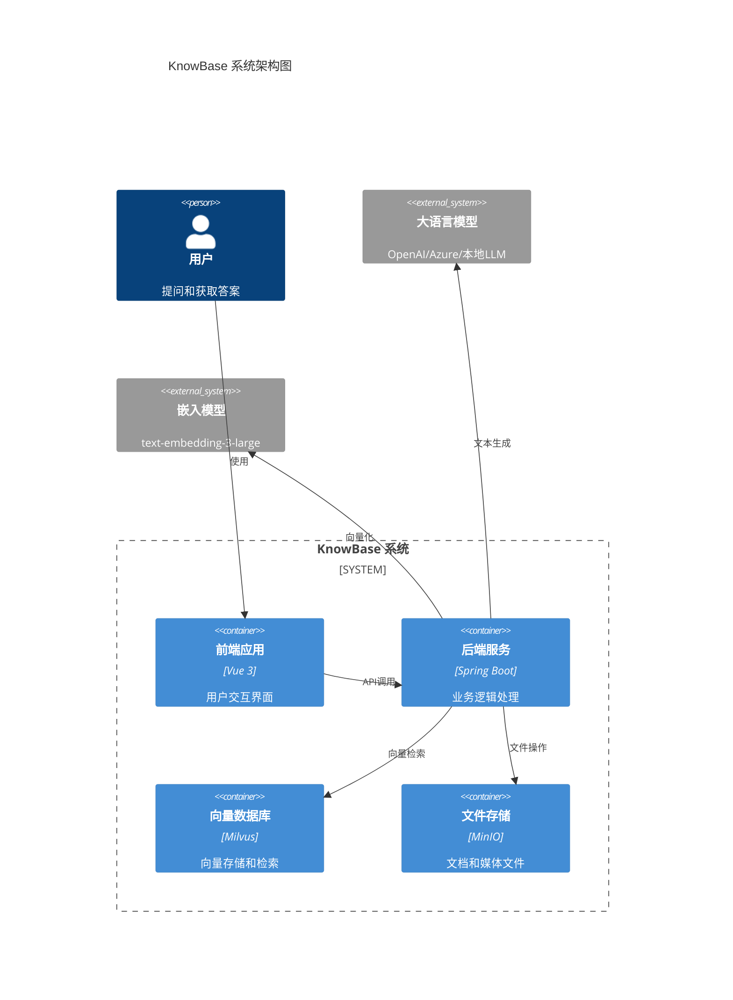
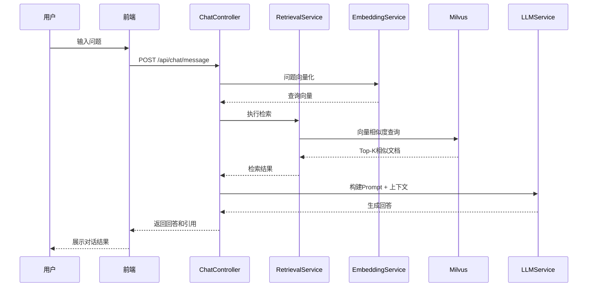
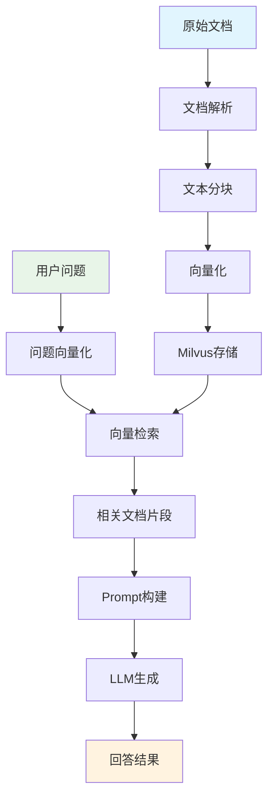

# 系统架构设计

## 📋 概述

KnowBase是一个基于RAG（Retrieval-Augmented Generation）架构的智能问答系统，采用微服务架构设计，具有高可扩展性和模块化特征。

## 🏗️ 整体架构

## 🔧 技术栈选型

### 前端技术栈
| 技术 | 版本 | 作用 | 选型理由 |
|------|------|------|----------|
| Vue 3 | 3.5+ | 前端框架 | 组合式API，更好的TypeScript支持 |
| Vite | 6.0+ | 构建工具 | 极快的热重载，现代化构建 |
| Element Plus | 2.8+ | UI组件库 | 成熟的Vue 3组件库 |
| Pinia | 2.2+ | 状态管理 | Vue 3官方推荐状态管理 |
| Axios | 1.7+ | HTTP客户端 | 强大的请求拦截和错误处理 |

### 后端技术栈
| 技术 | 版本 | 作用 | 选型理由 |
|------|------|------|----------|
| Spring Boot | 3.5+ | 应用框架 | 成熟的企业级框架 |
| Spring AI | 1.0+ | AI集成框架 | Spring生态AI解决方案 |
| Milvus Java SDK | 2.5+ | 向量数据库客户端 | 官方Java客户端 |
| Lombok | 1.18+ | 代码简化 | 减少样板代码 |
| Jackson | 2.17+ | JSON处理 | 高性能JSON序列化 |

### 基础设施
| 技术 | 版本 | 作用 | 选型理由 |
|------|------|------|----------|
| Milvus | 2.5+ | 向量数据库 | 高性能向量检索 |
| MinIO | RELEASE.2024+ | 对象存储 | S3兼容的本地存储 |
| Docker | 24.0+ | 容器化 | 标准化部署环境 |
| etcd | 3.5+ | 服务发现 | Milvus依赖组件 |

## 🏛️ 架构分层

### 1. 表现层（Presentation Layer）
- **职责**：用户交互、数据展示、路由管理
- **技术**：Vue 3 + Element Plus
- **组件**：
  - 聊天界面组件
  - 文档管理组件
  - 系统设置组件

### 2. 应用层（Application Layer）
- **职责**：业务流程编排、API接口、权限控制
- **技术**：Spring Boot + Spring AI
- **服务**：
  - ChatController：对话接口
  - DocumentController：文档管理
  - ConfigController：系统配置

### 3. 领域层（Domain Layer）
- **职责**：核心业务逻辑、RAG流程实现
- **技术**：Spring Services
- **服务**：
  - DocumentService：文档处理服务
  - EmbeddingService：向量化服务
  - RetrievalService：检索服务
  - ChatService：对话生成服务

### 4. 基础设施层（Infrastructure Layer）
- **职责**：数据持久化、外部服务集成
- **技术**：Milvus + MinIO + LLM APIs
- **组件**：
  - MilvusRepository：向量数据访问
  - FileStorageService：文件存储服务
  - LLMClient：大语言模型客户端

## 🔄 核心工作流程

## 📊 数据流架构

## 🔒 安全架构

### 1. 认证授权
- JWT Token认证
- RBAC权限控制
- API访问限制

### 2. 数据安全
- 传输加密（HTTPS/TLS）
- 敏感数据脱敏
- 访问日志记录

### 3. 系统安全
- 输入验证和过滤
- SQL注入防护
- XSS攻击防护

## 📈 可扩展性设计

### 1. 水平扩展
- 无状态服务设计
- 负载均衡支持
- 微服务架构

### 2. 模块化设计
- 插件式LLM支持
- 可替换嵌入模型
- 灵活的检索策略

### 3. 性能优化
- 向量索引优化
- 缓存策略
- 异步处理

## 🎯 设计原则

1. **单一职责**：每个模块职责明确，便于维护
2. **松耦合**：模块间依赖最小化，提高灵活性
3. **高内聚**：相关功能集中管理，提高复用性
4. **可测试**：支持单元测试和集成测试
5. **可观测**：完善的日志和监控体系

## 📝 架构决策记录

### ADR-001: 选择Milvus作为向量数据库
- **状态**：已采纳
- **原因**：高性能、云原生、活跃社区
- **替代方案**：Pinecone（商业）、Weaviate（复杂）

### ADR-002: 采用Spring AI框架
- **状态**：已采纳
- **原因**：Spring生态集成、多LLM支持
- **替代方案**：LangChain4j（文档较少）

### ADR-003: Vue 3组合式API
- **状态**：已采纳
- **原因**：更好的TypeScript支持、逻辑复用
- **替代方案**：Options API（不够灵活）

---

> 本文档将随着系统演进持续更新