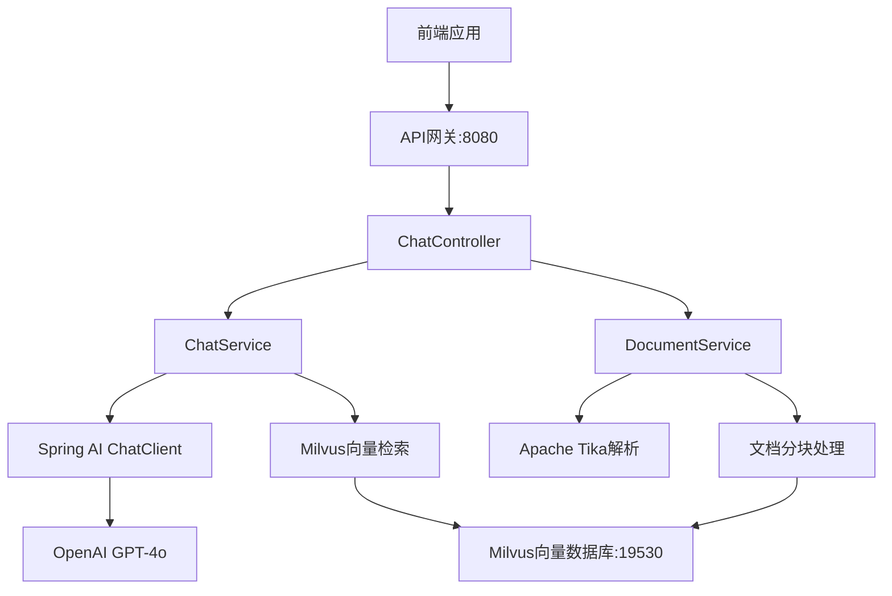

# KnowBase RAG AI 系统 - 后端API接口文档

> **版本**: v1.0.0  
> **基础URL**: `http://localhost:8080/api`  
> **协议**: HTTP/HTTPS  
> **数据格式**: JSON  
> **最后更新**: 2024年12月

---

## 📋 目录

1. [接口概览](#接口概览)
2. [系统架构](#系统架构)
3. [通用说明](#通用说明)
4. [认证机制](#认证机制)
5. [错误处理](#错误处理)
6. [接口详情](#接口详情)
7. [数据模型](#数据模型)
8. [状态码说明](#状态码说明)
9. [示例代码](#示例代码)
10. [性能指标](#性能指标)

---

## 🎯 接口概览

| 接口名称 | 方法 | 路径 | 功能描述 | 状态 |
|----------|------|------|----------|------|
| 健康检查 | GET | `/health` | 检查系统运行状态 | ✅ 已实现 |
| 智能对话 | POST | `/chat/message` | 基于RAG的AI对话 | ✅ 已实现 |
| 文档上传 | POST | `/documents/upload` | 上传文档到知识库 | ✅ 已实现 |

### 功能模块统计
| 功能模块 | 接口数量 | 完成度 |
|----------|----------|--------|
| 系统监控 | 1 | 100% |
| 智能对话 | 1 | 100% |
| 文档管理 | 1 | 100% |
| **总计** | **3** | **100%** |

---

## 🏗️ 系统架构



### 核心技术栈
- **Web框架**: Spring Boot 3.5.0
- **AI框架**: Spring AI 1.0.0
- **大语言模型**: OpenAI GPT-4o
- **嵌入模型**: BAAI/bge-m3
- **向量数据库**: Milvus 2.5.1
- **文档解析**: Apache Tika

---

## 📖 通用说明

### 请求格式规范
- **JSON请求**: `Content-Type: application/json`
- **文件上传**: `Content-Type: multipart/form-data`
- **字符编码**: UTF-8
- **请求方法**: RESTful标准

### 响应格式规范
所有接口都遵循统一的响应格式：

```json
{
  "data": {},           // 业务数据（成功时）
  "message": "string",  // 操作提示信息
  "timestamp": 1703000000000,  // 响应时间戳
  "success": true       // 操作是否成功
}
```

### 跨域支持
- 所有接口配置了 `@CrossOrigin` 注解
- 支持前端跨域访问
- 允许的方法：GET, POST, PUT, DELETE
- 允许的头部：Content-Type, Authorization

### 文件上传限制
- **最大文件大小**: 50MB
- **最大请求大小**: 50MB
- **支持格式**: PDF, DOC, DOCX, TXT, MD等（Apache Tika支持的所有格式）

---

## 🔐 认证机制

### 当前状态
**版本1.0.0**: 无需认证（开发测试阶段）

### 计划实现
**版本1.1.0** 将支持以下认证方式：
- JWT Token 认证
- API Key 认证
- OAuth 2.0 集成
- 基于角色的访问控制（RBAC）

---

## ❌ 错误处理

### 统一错误响应格式
```json
{
  "success": false,
  "error": {
    "code": "ERROR_CODE",
    "message": "用户友好的错误描述",
    "details": "技术详细错误信息",
    "path": "/api/chat/message",
    "method": "POST"
  },
  "timestamp": 1703000000000
}
```

### 常见错误码
| 错误码 | HTTP状态码 | 说明 | 解决方案 |
|--------|------------|------|----------|
| `INVALID_REQUEST` | 400 | 请求参数无效 | 检查请求参数格式 |
| `MISSING_PARAMETER` | 400 | 缺少必填参数 | 补充必填字段 |
| `FILE_TOO_LARGE` | 413 | 文件超出大小限制 | 压缩文件或分割上传 |
| `UNSUPPORTED_FORMAT` | 415 | 不支持的文件格式 | 使用支持的文件类型 |
| `INTERNAL_ERROR` | 500 | 服务器内部错误 | 联系技术支持 |
| `AI_SERVICE_ERROR` | 502 | AI服务调用失败 | 检查AI服务状态 |
| `VECTOR_DB_ERROR` | 503 | 向量数据库连接失败 | 检查Milvus服务状态 |

---

## 🔧 接口详情

### 1. 健康检查接口

**检查系统运行状态和服务可用性**

#### 基本信息
- **接口路径**: `/health`
- **请求方法**: `GET`
- **接口描述**: 检查后端服务、AI服务、向量数据库的运行状态
- **认证要求**: 无
- **缓存策略**: 无缓存
- **限流策略**: 无限制

#### 请求参数
无需任何参数

#### 请求示例
```bash
# cURL
curl -X GET "http://localhost:8080/api/health"

# HTTP
GET /api/health HTTP/1.1
Host: localhost:8080
```

#### 响应示例
```json
{
  "status": "OK",
  "service": "KnowBase RAG System"
}
```

#### 响应字段说明
| 字段 | 类型 | 必填 | 说明 |
|------|------|------|------|
| `status` | string | ✅ | 服务状态："OK"正常，"ERROR"异常 |
| `service` | string | ✅ | 服务名称标识 |

#### 使用场景
- 系统监控检查
- 负载均衡健康检查
- 服务发现注册
- 运维状态监控

---

### 2. 智能对话接口

**基于RAG技术的智能问答对话**

#### 基本信息
- **接口路径**: `/chat/message`
- **请求方法**: `POST`
- **接口描述**: 接收用户问题，基于已上传文档进行检索增强生成回答
- **认证要求**: 无
- **响应时间**: 通常2-5秒（取决于问题复杂度）
- **并发限制**: 建议≤10个并发请求

#### 技术实现流程
1. **问题预处理**: 清洗用户输入，提取关键信息
2. **向量检索**: 在Milvus中搜索Top-3相关文档片段（相似度≥0.6）
3. **上下文构建**: 将检索结果组装成提示词上下文
4. **AI生成**: 调用GPT-4o生成基于上下文的回答
5. **后处理**: 格式化回答，提取引用来源

#### 请求参数

**请求头**
```
Content-Type: application/json
```

**请求体**
| 字段 | 类型 | 必填 | 长度限制 | 说明 |
|------|------|------|----------|------|
| `message` | string | ✅ | 1-2000字符 | 用户输入的问题或消息 |

#### 请求示例
```bash
# cURL
curl -X POST "http://localhost:8080/api/chat/message" \
  -H "Content-Type: application/json" \
  -d '{
    "message": "什么是RAG技术？它有什么优势？"
  }'

# HTTP
POST /api/chat/message HTTP/1.1
Host: localhost:8080
Content-Type: application/json

{
  "message": "如何使用Spring AI框架？"
}
```

#### 响应示例
```json
{
  "answer": "RAG（Retrieval-Augmented Generation）是一种结合了检索和生成的AI技术。它通过以下方式工作：\n\n1. **检索阶段**：从知识库中检索与问题相关的文档片段\n2. **增强阶段**：将检索到的信息作为上下文提供给大语言模型\n3. **生成阶段**：基于上下文生成准确、有针对性的回答\n\n主要优势包括：\n- 提高回答的准确性和时效性\n- 减少模型幻觉问题\n- 支持领域专业知识问答\n- 可追溯信息来源",
  "references": [
    "RAG技术介绍.pdf (片段 1)",
    "AI技术白皮书.docx (片段 3)",
    "Spring AI文档.md (片段 7)"
  ],
  "timestamp": 1703000000000
}
```

#### 响应字段说明
| 字段 | 类型 | 必填 | 说明 |
|------|------|------|------|
| `answer` | string | ✅ | AI生成的回答内容，支持Markdown格式 |
| `references` | array | ✅ | 引用的文档片段列表，格式："文件名 (片段 序号)" |
| `timestamp` | long | ✅ | 响应生成的Unix时间戳 |

#### 特殊情况处理
```json
// 未找到相关文档时
{
  "answer": "抱歉，我没有找到相关的文档信息来回答您的问题。请先上传相关文档到知识库。",
  "references": [],
  "timestamp": 1703000000000
}

// AI服务异常时
{
  "answer": "处理您的问题时出现错误，请稍后重试。如问题持续存在，请联系技术支持。",
  "references": [],
  "timestamp": 1703000000000
}
```

---

### 3. 文档管理接口

**上传文档到知识库并自动处理**

#### 基本信息
- **接口路径**: `/documents/upload`
- **请求方法**: `POST`
- **接口描述**: 上传文档文件，自动解析、分块、向量化并存储到知识库
- **认证要求**: 无
- **处理时间**: 根据文件大小，通常10秒-2分钟
- **并发限制**: 建议≤3个并发上传

#### 文档处理流程
1. **文件验证**: 检查文件格式、大小是否符合要求
2. **内容提取**: 使用Apache Tika提取文档文本内容
3. **智能分块**: 按照语义边界分割文档（每块约500个token）
4. **向量化**: 使用BAAI/bge-m3模型生成1024维向量
5. **元数据标注**: 添加文件名、块索引、上传时间等信息
6. **数据库存储**: 将向量和元数据存储到Milvus

#### 支持文件格式
| 格式类别 | 支持格式 | 说明 |
|----------|----------|------|
| 文本文档 | .txt, .md, .rst | 纯文本格式 |
| Office文档 | .doc, .docx, .ppt, .pptx, .xls, .xlsx | Microsoft Office格式 |
| PDF文档 | .pdf | 包含文本的PDF文件 |
| 网页格式 | .html, .htm, .xml | 标记语言格式 |
| 其他格式 | .rtf, .odt, .csv | 其他常见文档格式 |

#### 请求参数

**请求头**
```
Content-Type: multipart/form-data
```

**表单参数**
| 字段 | 类型 | 必填 | 限制 | 说明 |
|------|------|------|------|------|
| `file` | file | ✅ | ≤50MB | 要上传的文档文件 |

#### 请求示例
```bash
# cURL
curl -X POST "http://localhost:8080/api/documents/upload" \
  -F "file=@/path/to/document.pdf"

# HTML表单
<form action="http://localhost:8080/api/documents/upload" 
      method="post" enctype="multipart/form-data">
  <input type="file" name="file" accept=".pdf,.doc,.docx,.txt,.md">
  <button type="submit">上传文档</button>
</form>
```

#### 响应示例
```json
// 上传成功
{
  "message": "文档 'Spring AI开发指南.pdf' 上传成功，共处理 23 个文档块"
}

// 上传失败
{
  "message": "文档上传失败: 不支持的文件格式 .xyz"
}
```

#### 响应字段说明
| 字段 | 类型 | 必填 | 说明 |
|------|------|------|------|
| `message` | string | ✅ | 上传结果描述，包含文件名和处理块数量 |

---

## 📊 数据模型

### ChatRequest（聊天请求）
```json
{
  "message": "string"     // 用户消息内容
}
```

### ChatResponse（聊天响应）
```json
{
  "answer": "string",      // AI生成的回答内容
  "references": [          // 引用文档列表
    "文件名.pdf (片段 1)",
    "文件名.docx (片段 3)"
  ],
  "timestamp": 1703000000000  // 响应时间戳
}
```

### UploadResponse（上传响应）
```json
{
  "message": "string"  // 上传结果描述信息
}
```

### HealthResponse（健康检查响应）
```json
{
  "status": "OK",              // 总体状态
  "service": "KnowBase RAG System"  // 服务名称
}
```

---

## 📋 状态码说明

### HTTP状态码对照表
| 状态码 | 含义 | 使用场景 | 处理建议 |
|--------|------|----------|----------|
| **2xx 成功** |
| 200 | OK | 请求成功 | 正常处理响应数据 |
| **4xx 客户端错误** |
| 400 | Bad Request | 请求参数错误 | 检查请求参数格式 |
| 413 | Payload Too Large | 请求体过大 | 减少文件大小 |
| 415 | Unsupported Media Type | 媒体类型不支持 | 使用支持的文件格式 |
| **5xx 服务器错误** |
| 500 | Internal Server Error | 服务器内部错误 | 联系技术支持 |
| 502 | Bad Gateway | 上游服务错误 | AI服务不可用 |
| 503 | Service Unavailable | 服务不可用 | 服务维护中 |


