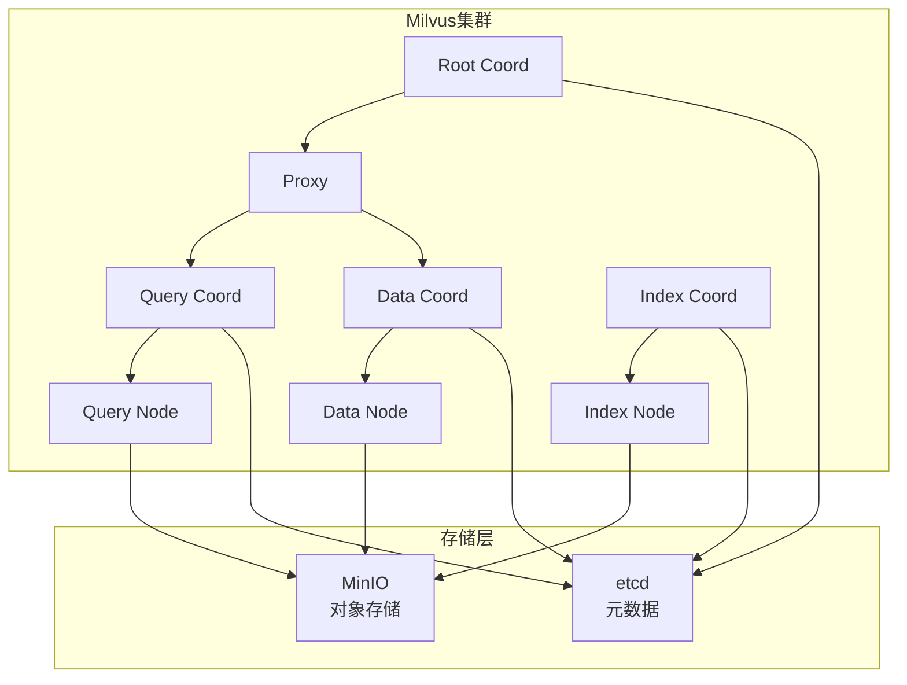
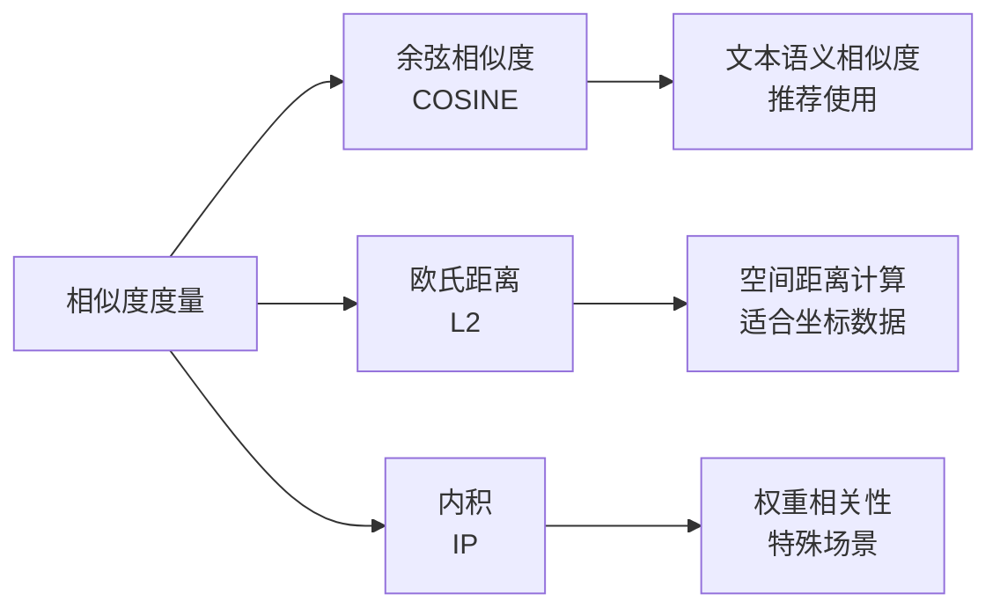

# Milvus数据库设计

## 📋 概述

Milvus是KnowBase系统的核心向量数据库，负责存储文档向量和执行相似度检索。本文档详细说明Milvus的设计方案、集合结构和优化策略。

## 🏗️ Milvus架构



## 📊 集合设计

### 1. 文档向量集合（documents）

```python
# 集合结构定义
collection_schema = {
    "collection_name": "documents",
    "description": "KnowBase文档向量集合",
    "fields": [
        {
            "field_name": "id",
            "data_type": DataType.INT64,
            "is_primary": True,
            "auto_id": True,
            "description": "主键ID"
        },
        {
            "field_name": "vector",
            "data_type": DataType.FLOAT_VECTOR,
            "params": {"dim": 1536},  # OpenAI text-embedding-3-large维度
            "description": "文档向量"
        },
        {
            "field_name": "document_id",
            "data_type": DataType.VARCHAR,
            "params": {"max_length": 64},
            "description": "文档唯一标识"
        },
        {
            "field_name": "chunk_id",
            "data_type": DataType.VARCHAR,
            "params": {"max_length": 64},
            "description": "文档块唯一标识"
        },
        {
            "field_name": "content",
            "data_type": DataType.VARCHAR,
            "params": {"max_length": 4096},
            "description": "文档内容文本"
        },
        {
            "field_name": "title",
            "data_type": DataType.VARCHAR,
            "params": {"max_length": 256},
            "description": "文档标题"
        },
        {
            "field_name": "file_type",
            "data_type": DataType.VARCHAR,
            "params": {"max_length": 32},
            "description": "文件类型"
        },
        {
            "field_name": "chunk_index",
            "data_type": DataType.INT32,
            "description": "块在文档中的序号"
        },
        {
            "field_name": "chunk_size",
            "data_type": DataType.INT32,
            "description": "块大小（字符数）"
        },
        {
            "field_name": "upload_time",
            "data_type": DataType.INT64,
            "description": "上传时间戳"
        },
        {
            "field_name": "metadata",
            "data_type": DataType.JSON,
            "description": "扩展元数据"
        }
    ]
}
```

### 2. 集合创建代码

```java
// Java代码示例
@Component
public class MilvusCollectionManager {
    
    @Autowired
    private MilvusServiceClient milvusClient;
    
    public void createDocumentCollection() {
        // 1. 定义字段
        List<FieldType> fields = Arrays.asList(
            FieldType.newBuilder()
                .withName("id")
                .withDataType(DataType.Int64)
                .withPrimaryKey(true)
                .withAutoID(true)
                .build(),
                
            FieldType.newBuilder()
                .withName("vector")
                .withDataType(DataType.FloatVector)
                .withDimension(1536)
                .build(),
                
            FieldType.newBuilder()
                .withName("document_id")
                .withDataType(DataType.VarChar)
                .withMaxLength(64)
                .build(),
                
            FieldType.newBuilder()
                .withName("content")
                .withDataType(DataType.VarChar)
                .withMaxLength(4096)
                .build(),
                
            FieldType.newBuilder()
                .withName("metadata")
                .withDataType(DataType.JSON)
                .build()
        );
        
        // 2. 创建集合结构
        CollectionSchema schema = CollectionSchema.newBuilder()
            .withName("documents")
            .withDescription("KnowBase文档向量集合")
            .withFields(fields)
            .build();
            
        // 3. 创建集合
        CreateCollectionParam param = CreateCollectionParam.newBuilder()
            .withCollectionName("documents")
            .withSchema(schema)
            .build();
            
        milvusClient.createCollection(param);
        
        // 4. 创建索引
        createVectorIndex();
    }
    
    private void createVectorIndex() {
        // HNSW索引参数
        Map<String, Object> indexParams = new HashMap<>();
        indexParams.put("metric_type", "COSINE");  // 余弦相似度
        indexParams.put("index_type", "HNSW");     // HNSW索引
        indexParams.put("M", 16);                  // HNSW参数M
        indexParams.put("efConstruction", 256);    // 构建参数
        
        CreateIndexParam param = CreateIndexParam.newBuilder()
            .withCollectionName("documents")
            .withFieldName("vector")
            .withIndexType(IndexType.HNSW)
            .withMetricType(MetricType.COSINE)
            .withExtraParam(indexParams)
            .build();
            
        milvusClient.createIndex(param);
    }
}
```

## 🔍 索引策略

### 1. 向量索引类型对比

| 索引类型 | 精度 | 查询速度 | 内存使用 | 适用场景 |
|----------|------|----------|----------|----------|
| FLAT | 100% | 慢 | 高 | 小数据集，高精度要求 |
| IVF_FLAT | 95% | 中等 | 中等 | 中等数据集，平衡精度和性能 |
| IVF_SQ8 | 90% | 快 | 低 | 大数据集，性能优先 |
| HNSW | 98% | 很快 | 高 | 大数据集，高精度和性能 |
| ANNOY | 85% | 快 | 低 | 超大数据集，内存限制 |

### 2. 推荐索引配置

#### HNSW索引（推荐）
```yaml
# 高精度高性能场景
index_type: HNSW
metric_type: COSINE
parameters:
  M: 16              # 连接数，影响精度和内存
  efConstruction: 256 # 构建时搜索宽度
  ef: 64             # 查询时搜索宽度
```

#### IVF_FLAT索引（平衡选择）
```yaml
# 平衡精度和性能
index_type: IVF_FLAT
metric_type: COSINE
parameters:
  nlist: 1024        # 聚类中心数量
  nprobe: 16         # 查询时探测的聚类数
```

### 3. 相似度度量选择



## 💾 数据操作

### 1. 插入向量数据

```java
@Service
public class MilvusRepository {
    
    @Autowired
    private MilvusServiceClient milvusClient;
    
    public String insertVector(float[] vector, DocumentMetadata metadata) {
        try {
            // 准备数据
            List<InsertParam.Field> fields = Arrays.asList(
                new InsertParam.Field("vector", Collections.singletonList(vector)),
                new InsertParam.Field("document_id", Collections.singletonList(metadata.getDocumentId())),
                new InsertParam.Field("content", Collections.singletonList(metadata.getContent())),
                new InsertParam.Field("title", Collections.singletonList(metadata.getTitle())),
                new InsertParam.Field("chunk_index", Collections.singletonList(metadata.getChunkIndex())),
                new InsertParam.Field("upload_time", Collections.singletonList(System.currentTimeMillis())),
                new InsertParam.Field("metadata", Collections.singletonList(metadata.toJsonString()))
            );
            
            // 插入数据
            InsertParam param = InsertParam.newBuilder()
                .withCollectionName("documents")
                .withFields(fields)
                .build();
                
            MutationResult result = milvusClient.insert(param);
            
            // 返回生成的ID
            return result.getIDs().getIntId().getData(0).toString();
            
        } catch (Exception e) {
            log.error("向量插入失败", e);
            throw new BusinessException("向量插入失败: " + e.getMessage());
        }
    }
    
    public void batchInsertVectors(List<VectorData> vectorDataList) {
        try {
            // 批量插入优化
            int batchSize = 1000;
            
            for (int i = 0; i < vectorDataList.size(); i += batchSize) {
                int end = Math.min(i + batchSize, vectorDataList.size());
                List<VectorData> batch = vectorDataList.subList(i, end);
                
                insertBatch(batch);
            }
            
            // 刷新数据到磁盘
            FlushParam flushParam = FlushParam.newBuilder()
                .withCollectionNames(Collections.singletonList("documents"))
                .build();
            milvusClient.flush(flushParam);
            
        } catch (Exception e) {
            log.error("批量插入失败", e);
            throw new BusinessException("批量插入失败: " + e.getMessage());
        }
    }
}
```

### 2. 向量检索

```java
public List<SearchResult> search(float[] queryVector, int topK) {
    try {
        // 构建搜索参数
        Map<String, Object> searchParams = new HashMap<>();
        searchParams.put("nprobe", 16);    // IVF索引参数
        searchParams.put("ef", 64);        // HNSW索引参数
        searchParams.put("radius", 0.1);   // 可选：相似度阈值
        
        SearchParam param = SearchParam.newBuilder()
            .withCollectionName("documents")
            .withMetricType(MetricType.COSINE)
            .withOutFields(Arrays.asList("content", "title", "document_id", "metadata"))
            .withTopK(topK)
            .withVectors(Collections.singletonList(queryVector))
            .withVectorFieldName("vector")
            .withParams(searchParams)
            .build();
            
        SearchResults results = milvusClient.search(param);
        
        // 处理搜索结果
        return processSearchResults(results);
        
    } catch (Exception e) {
        log.error("向量检索失败", e);
        throw new BusinessException("向量检索失败: " + e.getMessage());
    }
}

private List<SearchResult> processSearchResults(SearchResults results) {
    List<SearchResult> searchResults = new ArrayList<>();
    
    for (int i = 0; i < results.getNumOfQuery(); i++) {
        List<SearchResult.Hit> hits = results.getHits().get(i);
        
        for (SearchResult.Hit hit : hits) {
            SearchResult result = SearchResult.builder()
                .id(hit.getId())
                .score(hit.getScore())
                .content((String) hit.getEntity().get("content"))
                .title((String) hit.getEntity().get("title"))
                .documentId((String) hit.getEntity().get("document_id"))
                .metadata(parseMetadata((String) hit.getEntity().get("metadata")))
                .build();
                
            searchResults.add(result);
        }
    }
    
    return searchResults;
}
```

### 3. 数据删除

```java
public void deleteByDocumentId(String documentId) {
    try {
        // 构建删除表达式
        String deleteExpr = String.format("document_id == \"%s\"", documentId);
        
        DeleteParam param = DeleteParam.newBuilder()
            .withCollectionName("documents")
            .withExpr(deleteExpr)
            .build();
            
        milvusClient.delete(param);
        
        // 刷新删除操作
        FlushParam flushParam = FlushParam.newBuilder()
            .withCollectionNames(Collections.singletonList("documents"))
            .build();
        milvusClient.flush(flushParam);
        
    } catch (Exception e) {
        log.error("删除向量失败", e);
        throw new BusinessException("删除向量失败: " + e.getMessage());
    }
}
```

## 🔧 性能优化

### 1. 集合分区策略

```java
// 按时间分区
public void createTimeBasedPartitions() {
    String[] partitions = {
        "partition_2024_01", "partition_2024_02", "partition_2024_03"
    };
    
    for (String partition : partitions) {
        CreatePartitionParam param = CreatePartitionParam.newBuilder()
            .withCollectionName("documents")
            .withPartitionName(partition)
            .build();
        milvusClient.createPartition(param);
    }
}

// 按文档类型分区
public void createTypeBasedPartitions() {
    String[] partitions = {
        "partition_pdf", "partition_docx", "partition_txt"
    };
    
    for (String partition : partitions) {
        CreatePartitionParam param = CreatePartitionParam.newBuilder()
            .withCollectionName("documents")
            .withPartitionName(partition)
            .build();
        milvusClient.createPartition(param);
    }
}
```

### 2. 查询优化

```java
// 使用分区查询优化性能
public List<SearchResult> searchInPartition(float[] queryVector, 
                                           int topK, 
                                           String partitionName) {
    SearchParam param = SearchParam.newBuilder()
        .withCollectionName("documents")
        .withPartitionNames(Collections.singletonList(partitionName))
        .withMetricType(MetricType.COSINE)
        .withTopK(topK)
        .withVectors(Collections.singletonList(queryVector))
        .withVectorFieldName("vector")
        .build();
        
    return processSearchResults(milvusClient.search(param));
}

// 混合查询（向量+标量过滤）
public List<SearchResult> hybridSearch(float[] queryVector, 
                                      int topK, 
                                      String fileType) {
    String filterExpr = String.format("file_type == \"%s\"", fileType);
    
    SearchParam param = SearchParam.newBuilder()
        .withCollectionName("documents")
        .withMetricType(MetricType.COSINE)
        .withTopK(topK)
        .withVectors(Collections.singletonList(queryVector))
        .withVectorFieldName("vector")
        .withExpr(filterExpr)  // 标量过滤条件
        .build();
        
    return processSearchResults(milvusClient.search(param));
}
```

### 3. 连接池配置

```java
@Configuration
public class MilvusConfig {
    
    @Bean
    public MilvusServiceClient milvusClient() {
        ConnectParam connectParam = ConnectParam.newBuilder()
            .withHost("localhost")
            .withPort(19530)
            .withConnectTimeout(10000)
            .withKeepAliveTime(30000)
            .withKeepAliveTimeout(5000)
            .withKeepAliveWithoutCalls(false)
            .withSecure(false)
            .build();
            
        return new MilvusServiceClient(connectParam);
    }
}
```

## 📊 监控与维护

### 1. 集合状态监控

```java
@Component
public class MilvusMonitor {
    
    @Autowired
    private MilvusServiceClient milvusClient;
    
    public CollectionStatistics getCollectionStats() {
        GetCollectionStatisticsParam param = GetCollectionStatisticsParam.newBuilder()
            .withCollectionName("documents")
            .build();
            
        GetCollectionStatisticsResponse stats = milvusClient.getCollectionStatistics(param);
        
        return CollectionStatistics.builder()
            .rowCount(Long.parseLong(stats.getStats().get("row_count")))
            .build();
    }
    
    public void compactCollection() {
        CompactParam param = CompactParam.newBuilder()
            .withCollectionName("documents")
            .build();
            
        milvusClient.compact(param);
    }
}
```

### 2. 备份策略

```bash
# 使用Milvus备份工具
milvus-backup create \
  --collection-names documents \
  --backup-name backup_$(date +%Y%m%d_%H%M%S)

# 恢复备份
milvus-backup restore \
  --collection-suffix "_restored" \
  --backup-name backup_20241201_120000
```

## 🔒 安全配置

### 1. 访问控制

```yaml
# Milvus配置文件
common:
  security:
    authorizationEnabled: true
    
etcd:
  username: milvus
  password: your_password
  
minio:
  accessKeyID: milvus
  secretAccessKey: your_secret_key
```

### 2. 网络安全

```yaml
# Docker Compose网络配置
networks:
  milvus:
    driver: bridge
    ipam:
      config:
        - subnet: 172.20.0.0/16
```

## 📝 最佳实践

1. **向量维度选择**：根据嵌入模型确定，通常512-1536维
2. **批量操作**：使用批量插入提高性能，建议批次大小1000-5000
3. **索引选择**：HNSW适合高精度场景，IVF适合大规模数据
4. **分区策略**：按时间或类型分区，提高查询效率
5. **监控维护**：定期检查集合状态，执行压缩操作

---

> 详细的Milvus配置和优化请参考官方文档