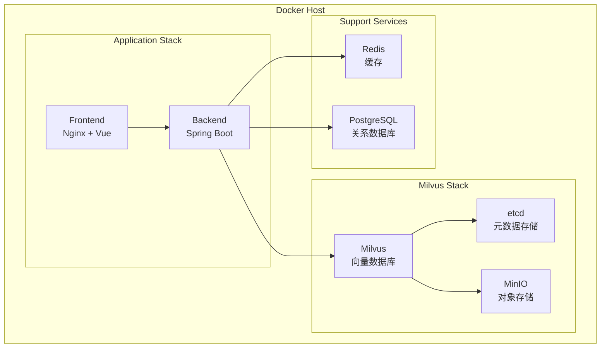

# Docker部署指南

## 📋 概述

本文档详细说明如何使用Docker和Docker Compose部署完整的KnowBase系统，包括后端服务、前端应用、Milvus向量数据库和相关依赖。

## 🏗️ 部署架构



## 📁 项目结构

```
KnowBase/
├── docker/
│   ├── docker-compose.yml              # 完整服务编排
│   ├── docker-compose.dev.yml          # 开发环境
│   ├── docker-compose.prod.yml         # 生产环境
│   ├── docker-compose.milvus.yml       # 单独的Milvus服务
│   ├── backend/
│   │   ├── Dockerfile                  # 后端服务镜像
│   │   └── entrypoint.sh               # 启动脚本
│   ├── frontend/
│   │   ├── Dockerfile                  # 前端服务镜像
│   │   └── nginx.conf                  # Nginx配置
│   ├── milvus/
│   │   ├── milvus.yaml                 # Milvus配置
│   │   └── user.yaml                   # 用户配置
│   └── scripts/
│       ├── init-db.sql                 # 数据库初始化
│       ├── wait-for-it.sh              # 服务等待脚本
│       └── backup.sh                   # 备份脚本
├── .env.example                        # 环境变量模板
├── .env                               # 环境变量配置
└── docker-compose.override.yml        # 本地覆盖配置
```

## 🔧 环境变量配置

### 1. 环境变量文件

创建 `.env` 文件：

```bash
# 基础配置
COMPOSE_PROJECT_NAME=knowbase
ENVIRONMENT=development

# 应用配置
BACKEND_PORT=8080
FRONTEND_PORT=3000
REDIS_PORT=6379
POSTGRES_PORT=5432

# Milvus配置
MILVUS_PORT=19530
MILVUS_HTTP_PORT=9091
ETCD_PORT=2379
MINIO_PORT=9000
MINIO_CONSOLE_PORT=9001

# 数据库配置
POSTGRES_DB=knowbase
POSTGRES_USER=postgres
POSTGRES_PASSWORD=postgres123
REDIS_PASSWORD=redis123

# MinIO配置
MINIO_ROOT_USER=minioadmin
MINIO_ROOT_PASSWORD=minioadmin123

# LLM配置
OPENAI_API_KEY=your_openai_api_key
OPENAI_BASE_URL=https://api.openai.com/v1
LLM_MODEL=gpt-4o-mini
EMBEDDING_MODEL=text-embedding-3-large

# 日志配置
LOG_LEVEL=INFO
LOG_MAX_SIZE=100MB
LOG_MAX_FILES=10

# 安全配置
JWT_SECRET=your_jwt_secret_key
CORS_ORIGINS=http://localhost:3000,http://localhost:5173

# 存储配置
UPLOAD_PATH=/app/data/uploads
MAX_FILE_SIZE=100MB
ALLOWED_FILE_TYPES=pdf,txt,md,docx,pptx

# 监控配置
ENABLE_METRICS=true
METRICS_PORT=9090
```

## 🐳 Docker镜像配置

### 1. 后端Dockerfile

```dockerfile
# docker/backend/Dockerfile
FROM openjdk:17-jdk-slim

# 安装依赖
RUN apt-get update && apt-get install -y \
    curl \
    wget \
    && rm -rf /var/lib/apt/lists/*

# 设置工作目录
WORKDIR /app

# 复制Maven包装器和pom.xml
COPY Backend/mvnw .
COPY Backend/mvnw.cmd .
COPY Backend/.mvn .mvn
COPY Backend/pom.xml .

# 下载依赖（利用Docker缓存）
RUN ./mvnw dependency:go-offline -B

# 复制源代码
COPY Backend/src src

# 构建应用
RUN ./mvnw clean package -DskipTests

# 创建运行时镜像
FROM openjdk:17-jre-slim

WORKDIR /app

# 复制应用程序
COPY --from=0 /app/target/*.jar app.jar

# 复制启动脚本
COPY docker/backend/entrypoint.sh entrypoint.sh
RUN chmod +x entrypoint.sh

# 创建用户
RUN groupadd -r appuser && useradd -r -g appuser appuser
RUN chown -R appuser:appuser /app
USER appuser

# 暴露端口
EXPOSE 8080

# 健康检查
HEALTHCHECK --interval=30s --timeout=3s --start-period=60s --retries=3 \
    CMD curl -f http://localhost:8080/actuator/health || exit 1

# 启动应用
ENTRYPOINT ["./entrypoint.sh"]
```

### 2. 后端启动脚本

```bash
#!/bin/bash
# docker/backend/entrypoint.sh

set -e

# 等待依赖服务启动
echo "等待数据库启动..."
while ! nc -z postgres 5432; do
  sleep 1
done

echo "等待Redis启动..."
while ! nc -z redis 6379; do
  sleep 1
done

echo "等待Milvus启动..."
while ! nc -z milvus 19530; do
  sleep 1
done

echo "所有依赖服务已启动，开始启动应用..."

# 设置JVM参数
JAVA_OPTS="${JAVA_OPTS} -Xms512m -Xmx2g"
JAVA_OPTS="${JAVA_OPTS} -Dspring.profiles.active=${ENVIRONMENT:-development}"
JAVA_OPTS="${JAVA_OPTS} -Djava.security.egd=file:/dev/./urandom"

# 启动应用
exec java ${JAVA_OPTS} -jar app.jar
```

### 3. 前端Dockerfile

```dockerfile
# docker/frontend/Dockerfile
# 构建阶段
FROM node:18-alpine AS builder

WORKDIR /app

# 复制package文件
COPY fontback/package*.json ./
COPY fontback/pnpm-lock.yaml ./

# 安装pnpm并下载依赖
RUN npm install -g pnpm
RUN pnpm install --frozen-lockfile

# 复制源代码
COPY fontback/ .

# 构建应用
RUN pnpm build

# 生产阶段
FROM nginx:alpine

# 复制Nginx配置
COPY docker/frontend/nginx.conf /etc/nginx/nginx.conf

# 复制构建产物
COPY --from=builder /app/dist /usr/share/nginx/html

# 创建日志目录
RUN mkdir -p /var/log/nginx

# 暴露端口
EXPOSE 80

# 健康检查
HEALTHCHECK --interval=30s --timeout=3s --start-period=10s --retries=3 \
    CMD wget --quiet --tries=1 --spider http://localhost/health || exit 1

# 启动Nginx
CMD ["nginx", "-g", "daemon off;"]
```

### 4. Nginx配置

```nginx
# docker/frontend/nginx.conf
events {
    worker_connections 1024;
}

http {
    include       /etc/nginx/mime.types;
    default_type  application/octet-stream;
    
    # 日志格式
    log_format main '$remote_addr - $remote_user [$time_local] "$request" '
                    '$status $body_bytes_sent "$http_referer" '
                    '"$http_user_agent" "$http_x_forwarded_for"';
    
    access_log /var/log/nginx/access.log main;
    error_log /var/log/nginx/error.log warn;
    
    # 基础配置
    sendfile on;
    tcp_nopush on;
    tcp_nodelay on;
    keepalive_timeout 65;
    types_hash_max_size 2048;
    
    # Gzip压缩
    gzip on;
    gzip_vary on;
    gzip_min_length 1024;
    gzip_proxied any;
    gzip_comp_level 6;
    gzip_types
        application/json
        application/javascript
        application/xml+rss
        application/atom+xml
        image/svg+xml
        text/plain
        text/css
        text/xml
        text/javascript;
    
    # 上游后端服务
    upstream backend {
        server backend:8080;
    }
    
    server {
        listen 80;
        server_name localhost;
        root /usr/share/nginx/html;
        index index.html;
        
        # 静态文件缓存
        location ~* \.(js|css|png|jpg|jpeg|gif|ico|svg|woff|woff2|ttf|eot)$ {
            expires 1y;
            add_header Cache-Control "public, immutable";
        }
        
        # API代理
        location /api/ {
            proxy_pass http://backend;
            proxy_set_header Host $host;
            proxy_set_header X-Real-IP $remote_addr;
            proxy_set_header X-Forwarded-For $proxy_add_x_forwarded_for;
            proxy_set_header X-Forwarded-Proto $scheme;
            
            # 超时设置
            proxy_connect_timeout 60s;
            proxy_send_timeout 60s;
            proxy_read_timeout 60s;
            
            # 文件上传大小限制
            client_max_body_size 100M;
        }
        
        # 健康检查端点
        location /health {
            access_log off;
            return 200 "healthy\n";
            add_header Content-Type text/plain;
        }
        
        # Vue Router支持
        location / {
            try_files $uri $uri/ /index.html;
        }
        
        # 错误页面
        error_page 404 /index.html;
        error_page 500 502 503 504 /50x.html;
        location = /50x.html {
            root /usr/share/nginx/html;
        }
    }
}
```

## 🚀 Docker Compose配置

### 1. 完整服务编排

```yaml
# docker-compose.yml
version: '3.8'

services:
  # 前端服务
  frontend:
    build:
      context: .
      dockerfile: docker/frontend/Dockerfile
    ports:
      - "${FRONTEND_PORT:-3000}:80"
    depends_on:
      - backend
    environment:
      - BACKEND_URL=http://backend:8080
    networks:
      - knowbase-network
    restart: unless-stopped
    
  # 后端服务
  backend:
    build:
      context: .
      dockerfile: docker/backend/Dockerfile
    ports:
      - "${BACKEND_PORT:-8080}:8080"
    environment:
      - SPRING_PROFILES_ACTIVE=${ENVIRONMENT:-development}
      - SPRING_DATASOURCE_URL=jdbc:postgresql://postgres:5432/${POSTGRES_DB}
      - SPRING_DATASOURCE_USERNAME=${POSTGRES_USER}
      - SPRING_DATASOURCE_PASSWORD=${POSTGRES_PASSWORD}
      - SPRING_REDIS_HOST=redis
      - SPRING_REDIS_PASSWORD=${REDIS_PASSWORD}
      - MILVUS_HOST=milvus
      - MILVUS_PORT=19530
      - OPENAI_API_KEY=${OPENAI_API_KEY}
      - OPENAI_BASE_URL=${OPENAI_BASE_URL}
      - UPLOAD_PATH=${UPLOAD_PATH}
      - JWT_SECRET=${JWT_SECRET}
    volumes:
      - ./data/uploads:/app/data/uploads
      - ./logs/backend:/app/logs
    depends_on:
      - postgres
      - redis
      - milvus
    networks:
      - knowbase-network
    restart: unless-stopped
    
  # PostgreSQL数据库
  postgres:
    image: postgres:15
    environment:
      - POSTGRES_DB=${POSTGRES_DB}
      - POSTGRES_USER=${POSTGRES_USER}
      - POSTGRES_PASSWORD=${POSTGRES_PASSWORD}
    volumes:
      - postgres_data:/var/lib/postgresql/data
      - ./docker/scripts/init-db.sql:/docker-entrypoint-initdb.d/init-db.sql
    ports:
      - "${POSTGRES_PORT:-5432}:5432"
    networks:
      - knowbase-network
    restart: unless-stopped
    
  # Redis缓存
  redis:
    image: redis:7-alpine
    command: redis-server --requirepass ${REDIS_PASSWORD}
    ports:
      - "${REDIS_PORT:-6379}:6379"
    volumes:
      - redis_data:/data
    networks:
      - knowbase-network
    restart: unless-stopped
    
  # Milvus向量数据库
  milvus:
    image: milvusdb/milvus:v2.5.1
    command: ["milvus", "run", "standalone"]
    environment:
      - ETCD_ENDPOINTS=etcd:2379
      - MINIO_ADDRESS=minio:9000
      - MINIO_ACCESS_KEY=${MINIO_ROOT_USER}
      - MINIO_SECRET_KEY=${MINIO_ROOT_PASSWORD}
    volumes:
      - ./docker/milvus/milvus.yaml:/milvus/configs/milvus.yaml
      - milvus_data:/var/lib/milvus
    ports:
      - "${MILVUS_PORT:-19530}:19530"
      - "${MILVUS_HTTP_PORT:-9091}:9091"
    depends_on:
      - etcd
      - minio
    networks:
      - knowbase-network
    restart: unless-stopped
    
  # etcd（Milvus依赖）
  etcd:
    image: quay.io/coreos/etcd:v3.5.5
    environment:
      - ETCD_AUTO_COMPACTION_MODE=revision
      - ETCD_AUTO_COMPACTION_RETENTION=1000
      - ETCD_QUOTA_BACKEND_BYTES=4294967296
      - ETCD_SNAPSHOT_COUNT=50000
    command: etcd -advertise-client-urls=http://127.0.0.1:2379 -listen-client-urls http://0.0.0.0:2379 --data-dir /etcd
    volumes:
      - etcd_data:/etcd
    ports:
      - "${ETCD_PORT:-2379}:2379"
    networks:
      - knowbase-network
    restart: unless-stopped
    
  # MinIO对象存储（Milvus依赖）
  minio:
    image: minio/minio:RELEASE.2024-01-01T16-36-33Z
    environment:
      - MINIO_ROOT_USER=${MINIO_ROOT_USER}
      - MINIO_ROOT_PASSWORD=${MINIO_ROOT_PASSWORD}
    command: minio server /minio_data --console-address ":9001"
    volumes:
      - minio_data:/minio_data
    ports:
      - "${MINIO_PORT:-9000}:9000"
      - "${MINIO_CONSOLE_PORT:-9001}:9001"
    networks:
      - knowbase-network
    restart: unless-stopped
    
  # Attu（Milvus管理界面）
  attu:
    image: zilliz/attu:v2.5.1
    environment:
      - MILVUS_URL=milvus:19530
    ports:
      - "8000:3000"
    depends_on:
      - milvus
    networks:
      - knowbase-network
    restart: unless-stopped

volumes:
  postgres_data:
  redis_data:
  milvus_data:
  etcd_data:
  minio_data:

networks:
  knowbase-network:
    driver: bridge
```

### 2. 开发环境配置

```yaml
# docker-compose.dev.yml
version: '3.8'

services:
  backend:
    environment:
      - SPRING_PROFILES_ACTIVE=development
      - LOGGING_LEVEL_ORG_EXAMPLE_BACKEND=DEBUG
      - SPRING_DEVTOOLS_RESTART_ENABLED=true
    volumes:
      - ./Backend/src:/app/src
    ports:
      - "5005:5005"  # JVM调试端口
    command: ["java", "-agentlib:jdwp=transport=dt_socket,server=y,suspend=n,address=*:5005", "-jar", "app.jar"]
    
  frontend:
    volumes:
      - ./fontback/src:/app/src
    environment:
      - NODE_ENV=development
      - VITE_API_BASE_URL=http://localhost:8080/api
```

### 3. 生产环境配置

```yaml
# docker-compose.prod.yml
version: '3.8'

services:
  frontend:
    environment:
      - NODE_ENV=production
    deploy:
      replicas: 2
      resources:
        limits:
          cpus: '1'
          memory: 512M
        reservations:
          cpus: '0.5'
          memory: 256M
    
  backend:
    environment:
      - SPRING_PROFILES_ACTIVE=production
      - JAVA_OPTS=-Xms1g -Xmx4g
    deploy:
      replicas: 2
      resources:
        limits:
          cpus: '2'
          memory: 4G
        reservations:
          cpus: '1'
          memory: 2G
    
  postgres:
    deploy:
      resources:
        limits:
          cpus: '1'
          memory: 2G
        reservations:
          cpus: '0.5'
          memory: 1G
    
  milvus:
    deploy:
      resources:
        limits:
          cpus: '2'
          memory: 4G
        reservations:
          cpus: '1'
          memory: 2G
```

## 🚀 部署流程

### 1. 快速启动

```bash
# 克隆项目
git clone https://github.com/Saika02/KnowBase.git
cd KnowBase

# 复制环境变量配置
cp .env.example .env

# 编辑环境变量
vim .env

# 启动所有服务
docker-compose up -d

# 查看启动日志
docker-compose logs -f

# 检查服务状态
docker-compose ps
```

### 2. 分步启动

```bash
# 1. 启动基础服务
docker-compose up -d postgres redis etcd minio

# 2. 等待基础服务就绪
sleep 30

# 3. 启动Milvus
docker-compose up -d milvus

# 4. 等待Milvus就绪
sleep 60

# 5. 启动应用服务
docker-compose up -d backend frontend

# 6. 启动管理界面
docker-compose up -d attu
```

### 3. 健康检查

```bash
# 检查所有服务状态
docker-compose ps

# 检查特定服务日志
docker-compose logs backend
docker-compose logs milvus

# 检查服务健康状态
curl http://localhost:8080/actuator/health
curl http://localhost:3000/health

# 检查Milvus连接
docker-compose exec milvus milvus_cli
```

## 🔧 运维管理

### 1. 服务管理命令

```bash
# 启动服务
docker-compose up -d [service_name]

# 停止服务
docker-compose stop [service_name]

# 重启服务
docker-compose restart [service_name]

# 查看日志
docker-compose logs -f [service_name]

# 进入容器
docker-compose exec [service_name] bash

# 扩缩容
docker-compose up -d --scale backend=3

# 更新服务
docker-compose pull
docker-compose up -d --force-recreate
```

### 2. 数据备份

```bash
#!/bin/bash
# docker/scripts/backup.sh

BACKUP_DIR="/backup/$(date +%Y%m%d_%H%M%S)"
mkdir -p $BACKUP_DIR

# 备份PostgreSQL
docker-compose exec -T postgres pg_dump -U postgres knowbase > $BACKUP_DIR/postgres.sql

# 备份Redis
docker-compose exec -T redis redis-cli --rdb - > $BACKUP_DIR/redis.rdb

# 备份Milvus
docker-compose exec -T milvus milvus-backup create --collection-names documents --backup-name daily_backup

# 备份上传文件
tar -czf $BACKUP_DIR/uploads.tar.gz ./data/uploads

echo "备份完成: $BACKUP_DIR"
```

### 3. 监控脚本

```bash
#!/bin/bash
# docker/scripts/monitor.sh

# 检查容器状态
check_container_health() {
    local container=$1
    local status=$(docker-compose ps -q $container | xargs docker inspect --format='{{.State.Health.Status}}' 2>/dev/null)
    
    if [ "$status" = "healthy" ]; then
        echo "✅ $container is healthy"
    else
        echo "❌ $container is unhealthy: $status"
        docker-compose logs --tail=20 $container
    fi
}

# 检查所有服务
services=("frontend" "backend" "postgres" "redis" "milvus")
for service in "${services[@]}"; do
    check_container_health $service
done
```

## 🐛 故障排除

### 1. 常见问题

#### Milvus启动失败
```bash
# 检查依赖服务
docker-compose ps etcd minio

# 查看Milvus日志
docker-compose logs milvus

# 重置Milvus数据
docker-compose down
docker volume rm knowbase_milvus_data
docker-compose up -d
```

#### 后端连接数据库失败
```bash
# 检查PostgreSQL状态
docker-compose exec postgres pg_isready

# 检查网络连接
docker-compose exec backend ping postgres

# 查看后端启动日志
docker-compose logs backend
```

#### 前端无法访问API
```bash
# 检查Nginx配置
docker-compose exec frontend nginx -t

# 检查代理配置
curl -I http://localhost:3000/api/health

# 重新加载Nginx配置
docker-compose exec frontend nginx -s reload
```

### 2. 性能调优

```yaml
# 系统资源优化
version: '3.8'

x-common-variables: &common-variables
  JAVA_OPTS: "-Xms1g -Xmx4g -XX:+UseG1GC"

services:
  backend:
    environment:
      <<: *common-variables
    deploy:
      resources:
        limits:
          cpus: '2'
          memory: 4G
    ulimits:
      nofile:
        soft: 65536
        hard: 65536
```

## 📝 最佳实践

1. **环境变量管理**：敏感信息使用外部配置
2. **数据持久化**：重要数据使用命名卷
3. **健康检查**：配置合适的健康检查策略
4. **资源限制**：设置合理的CPU和内存限制
5. **日志管理**：配置日志轮转和清理策略
6. **网络安全**：使用内部网络隔离服务
7. **备份策略**：定期备份数据和配置文件

---

> 详细的生产环境部署指南请参考运维文档