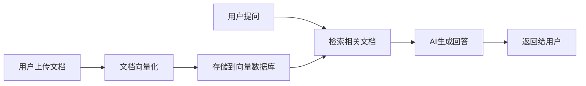

# KnowBase 快速开发指南 (期末作业版)

## 📋 项目简介

KnowBase是一个简化的RAG (Retrieval-Augmented Generation) AI对话系统，专为期末作业设计。系统包含：
- 📄 文档上传和处理
- 🔍 向量检索
- 🤖 AI智能对话
- 💬 简洁的聊天界面

## 🎯 核心功能



## 🏗️ 项目结构 (简化版)

```
KnowBase/
├── Backend/                    # Spring Boot后端
│   ├── src/main/java/
│   │   └── org/example/backend/
│   │       ├── BackendApplication.java     # 启动类
│   │       ├── controller/
│   │       │   ├── ChatController.java     # 聊天接口
│   │       │   └── DocumentController.java # 文档上传
│   │       ├── service/
│   │       │   ├── ChatService.java        # 对话服务
│   │       │   ├── DocumentService.java    # 文档处理
│   │       │   └── VectorService.java      # 向量操作
│   │       └── model/
│   │           ├── ChatRequest.java        # 请求模型
│   │           └── ChatResponse.java       # 响应模型
│   └── src/main/resources/
│       └── application.yml                 # 配置文件
├── fontback/                   # Vue前端
│   ├── src/
│   │   ├── components/
│   │   │   ├── ChatWindow.vue              # 聊天窗口
│   │   │   └── DocumentUpload.vue          # 文档上传
│   │   ├── views/
│   │   │   └── Home.vue                    # 主页面
│   │   └── App.vue                         # 根组件
│   └── package.json
└── docker/
    └── docker-compose-simple.yml          # 简化部署配置
```

## 🛠️ 快速搭建指南

### 1. 后端核心代码

#### 聊天控制器 (简化版)
```java
// Backend/src/main/java/org/example/backend/controller/ChatController.java
@RestController
@RequestMapping("/api/chat")
@CrossOrigin
public class ChatController {
    
    @Autowired
    private ChatService chatService;
    
    @PostMapping("/message")
    public ChatResponse sendMessage(@RequestBody ChatRequest request) {
        return chatService.processMessage(request.getMessage());
    }
}
```

#### 对话服务 (核心逻辑)
```java
// Backend/src/main/java/org/example/backend/service/ChatService.java
@Service
public class ChatService {
    
    @Autowired
    private VectorService vectorService;
    
    // 模拟OpenAI调用 (可替换为实际API)
    public ChatResponse processMessage(String userMessage) {
        try {
            // 1. 检索相关文档
            List<String> relevantDocs = vectorService.searchSimilarDocuments(userMessage, 3);
            
            // 2. 构建上下文
            String context = String.join("\n", relevantDocs);
            
            // 3. 生成回答 (简化版，可接入真实LLM API)
            String answer = generateAnswer(userMessage, context);
            
            return new ChatResponse(answer, relevantDocs);
            
        } catch (Exception e) {
            return new ChatResponse("抱歉，处理您的问题时出现错误", Collections.emptyList());
        }
    }
    
    private String generateAnswer(String question, String context) {
        // 简化的回答生成逻辑 (期末作业可用模拟数据)
        if (context.isEmpty()) {
            return "抱歉，我没有找到相关的文档信息来回答您的问题。";
        }
        
        return String.format(
            "根据相关文档，关于「%s」的回答是：\n\n%s\n\n以上信息来源于已上传的文档。", 
            question, 
            context.substring(0, Math.min(context.length(), 200)) + "..."
        );
    }
}
```

#### 向量服务 (简化版)
```java
// Backend/src/main/java/org/example/backend/service/VectorService.java
@Service
public class VectorService {
    
    // 简化存储 (期末作业可用内存存储)
    private List<DocumentChunk> documentChunks = new ArrayList<>();
    
    public void addDocument(String content, String title) {
        // 简单分块策略
        List<String> chunks = splitIntoChunks(content, 500);
        
        for (int i = 0; i < chunks.size(); i++) {
            DocumentChunk chunk = new DocumentChunk();
            chunk.setContent(chunks.get(i));
            chunk.setTitle(title);
            chunk.setChunkIndex(i);
            documentChunks.add(chunk);
        }
    }
    
    public List<String> searchSimilarDocuments(String query, int topK) {
        // 简化的相似度计算 (关键词匹配)
        return documentChunks.stream()
            .filter(chunk -> calculateSimilarity(query, chunk.getContent()) > 0.1)
            .sorted((a, b) -> Double.compare(
                calculateSimilarity(query, b.getContent()),
                calculateSimilarity(query, a.getContent())
            ))
            .limit(topK)
            .map(DocumentChunk::getContent)
            .collect(Collectors.toList());
    }
    
    private double calculateSimilarity(String query, String content) {
        // 简单的关键词匹配相似度 (期末作业适用)
        String[] queryWords = query.toLowerCase().split("\\s+");
        String contentLower = content.toLowerCase();
        
        long matchCount = Arrays.stream(queryWords)
            .filter(contentLower::contains)
            .count();
            
        return (double) matchCount / queryWords.length;
    }
    
    private List<String> splitIntoChunks(String content, int chunkSize) {
        List<String> chunks = new ArrayList<>();
        for (int i = 0; i < content.length(); i += chunkSize) {
            int end = Math.min(i + chunkSize, content.length());
            chunks.add(content.substring(i, end));
        }
        return chunks;
    }
}
```

#### 数据模型
```java
// Backend/src/main/java/org/example/backend/model/ChatRequest.java
public class ChatRequest {
    private String message;
    
    // getter/setter
    public String getMessage() { return message; }
    public void setMessage(String message) { this.message = message; }
}

// Backend/src/main/java/org/example/backend/model/ChatResponse.java
public class ChatResponse {
    private String answer;
    private List<String> references;
    
    public ChatResponse(String answer, List<String> references) {
        this.answer = answer;
        this.references = references;
    }
    
    // getter/setter
    public String getAnswer() { return answer; }
    public void setAnswer(String answer) { this.answer = answer; }
    public List<String> getReferences() { return references; }
    public void setReferences(List<String> references) { this.references = references; }
}
```

### 2. 前端核心代码

#### 主聊天组件
```vue
<!-- fontback/src/components/ChatWindow.vue -->
<template>
  <div class="chat-container">
    <div class="chat-header">
      <h2>📚 KnowBase AI助手</h2>
    </div>
    
    <div class="chat-messages" ref="messagesContainer">
      <div v-for="message in messages" :key="message.id" class="message">
        <div :class="['message-bubble', message.isUser ? 'user' : 'ai']">
          <div class="message-content">{{ message.content }}</div>
          <div v-if="message.references?.length" class="references">
            <small>📖 参考文档：{{ message.references.length }}个片段</small>
          </div>
        </div>
      </div>
    </div>
    
    <div class="chat-input">
      <input 
        v-model="inputMessage" 
        @keydown.enter="sendMessage"
        placeholder="输入您的问题..."
        :disabled="isLoading"
      />
      <button @click="sendMessage" :disabled="!inputMessage.trim() || isLoading">
        {{ isLoading ? '思考中...' : '发送' }}
      </button>
    </div>
  </div>
</template>

<script>
export default {
  name: 'ChatWindow',
  data() {
    return {
      messages: [],
      inputMessage: '',
      isLoading: false
    }
  },
  methods: {
    async sendMessage() {
      if (!this.inputMessage.trim()) return;
      
      // 添加用户消息
      const userMessage = {
        id: Date.now(),
        content: this.inputMessage,
        isUser: true
      };
      this.messages.push(userMessage);
      
      const question = this.inputMessage;
      this.inputMessage = '';
      this.isLoading = true;
      
      try {
        // 调用后端API
        const response = await fetch('/api/chat/message', {
          method: 'POST',
          headers: {
            'Content-Type': 'application/json'
          },
          body: JSON.stringify({ message: question })
        });
        
        const result = await response.json();
        
        // 添加AI回答
        const aiMessage = {
          id: Date.now() + 1,
          content: result.answer,
          isUser: false,
          references: result.references
        };
        this.messages.push(aiMessage);
        
      } catch (error) {
        console.error('发送消息失败:', error);
        this.messages.push({
          id: Date.now() + 1,
          content: '抱歉，系统出现错误，请稍后重试。',
          isUser: false
        });
      } finally {
        this.isLoading = false;
        this.$nextTick(() => this.scrollToBottom());
      }
    },
    
    scrollToBottom() {
      const container = this.$refs.messagesContainer;
      container.scrollTop = container.scrollHeight;
    }
  }
}
</script>

<style scoped>
.chat-container {
  max-width: 800px;
  margin: 0 auto;
  height: 600px;
  border: 1px solid #ddd;
  border-radius: 8px;
  display: flex;
  flex-direction: column;
}

.chat-header {
  background: #4CAF50;
  color: white;
  padding: 1rem;
  text-align: center;
}

.chat-messages {
  flex: 1;
  overflow-y: auto;
  padding: 1rem;
  background: #f9f9f9;
}

.message {
  margin-bottom: 1rem;
}

.message-bubble {
  max-width: 70%;
  padding: 0.8rem;
  border-radius: 18px;
  word-wrap: break-word;
}

.message-bubble.user {
  background: #007bff;
  color: white;
  margin-left: auto;
}

.message-bubble.ai {
  background: white;
  border: 1px solid #ddd;
}

.references {
  margin-top: 0.5rem;
  opacity: 0.7;
}

.chat-input {
  display: flex;
  padding: 1rem;
  border-top: 1px solid #ddd;
}

.chat-input input {
  flex: 1;
  padding: 0.8rem;
  border: 1px solid #ddd;
  border-radius: 20px;
  margin-right: 0.5rem;
}

.chat-input button {
  padding: 0.8rem 1.5rem;
  background: #4CAF50;
  color: white;
  border: none;
  border-radius: 20px;
  cursor: pointer;
}

.chat-input button:disabled {
  background: #ccc;
  cursor: not-allowed;
}
</style>
```

#### 文档上传组件
```vue
<!-- fontback/src/components/DocumentUpload.vue -->
<template>
  <div class="upload-container">
    <div class="upload-area" @drop="handleDrop" @dragover.prevent>
      <input type="file" ref="fileInput" @change="handleFileSelect" style="display: none;" accept=".txt,.md,.pdf">
      <div class="upload-content">
        <div class="upload-icon">📄</div>
        <p>拖拽文件到这里或 <button @click="$refs.fileInput.click()">选择文件</button></p>
        <small>支持 .txt, .md, .pdf 格式</small>
      </div>
    </div>
    
    <div v-if="uploading" class="upload-status">
      正在处理文档...
    </div>
    
    <div v-if="uploadedFiles.length" class="uploaded-files">
      <h4>已上传文档：</h4>
      <ul>
        <li v-for="file in uploadedFiles" :key="file.name">
          📄 {{ file.name }}
        </li>
      </ul>
    </div>
  </div>
</template>

<script>
export default {
  name: 'DocumentUpload',
  data() {
    return {
      uploading: false,
      uploadedFiles: []
    }
  },
  methods: {
    handleDrop(event) {
      event.preventDefault();
      const files = event.dataTransfer.files;
      if (files.length > 0) {
        this.uploadFile(files[0]);
      }
    },
    
    handleFileSelect(event) {
      const file = event.target.files[0];
      if (file) {
        this.uploadFile(file);
      }
    },
    
    async uploadFile(file) {
      this.uploading = true;
      
      try {
        const formData = new FormData();
        formData.append('file', file);
        
        const response = await fetch('/api/documents/upload', {
          method: 'POST',
          body: formData
        });
        
        if (response.ok) {
          this.uploadedFiles.push({ name: file.name });
          alert('文档上传成功！');
        } else {
          alert('文档上传失败，请重试。');
        }
      } catch (error) {
        console.error('上传错误:', error);
        alert('上传过程中出现错误。');
      } finally {
        this.uploading = false;
      }
    }
  }
}
</script>

<style scoped>
.upload-container {
  margin-bottom: 2rem;
}

.upload-area {
  border: 2px dashed #ccc;
  border-radius: 8px;
  padding: 2rem;
  text-align: center;
  cursor: pointer;
  transition: border-color 0.3s;
}

.upload-area:hover {
  border-color: #4CAF50;
}

.upload-icon {
  font-size: 3rem;
  margin-bottom: 1rem;
}

.upload-content button {
  background: #4CAF50;
  color: white;
  border: none;
  padding: 0.5rem 1rem;
  border-radius: 4px;
  cursor: pointer;
}

.uploaded-files {
  margin-top: 1rem;
  padding: 1rem;
  background: #f0f0f0;
  border-radius: 4px;
}

.uploaded-files ul {
  list-style: none;
  padding: 0;
}

.uploaded-files li {
  padding: 0.5rem 0;
}
</style>
```

### 3. 简化配置

#### 后端配置
```yaml
# Backend/src/main/resources/application.yml
server:
  port: 8080

spring:
  application:
    name: knowbase-simple
  servlet:
    multipart:
      max-file-size: 50MB
      max-request-size: 50MB

# 简化配置，去掉复杂的数据库配置
logging:
  level:
    org.example.backend: DEBUG
```

#### 前端依赖简化
```json
{
  "name": "knowbase-frontend-simple",
  "version": "1.0.0",
  "scripts": {
    "dev": "vite",
    "build": "vite build"
  },
  "dependencies": {
    "vue": "^3.5.13"
  },
  "devDependencies": {
    "@vitejs/plugin-vue": "^5.2.3",
    "vite": "^6.2.4"
  }
}
```

## 🚀 运行指南

### 1. 后端启动
```bash
cd Backend
./mvnw spring-boot:run
```

### 2. 前端启动
```bash
cd fontback
npm install
npm run dev
```

### 3. 访问系统
- 前端界面：http://localhost:5173
- 后端API：http://localhost:8080

## 🎯 演示场景

### 1. 基本演示流程
1. 上传一个文本文档（可以是课程资料）
2. 在聊天界面提问相关问题
3. 系统检索相关内容并生成回答
4. 展示引用的文档片段

### 2. 示例对话
```
用户：什么是人工智能？
AI：根据相关文档，关于「什么是人工智能」的回答是：

人工智能（Artificial Intelligence，AI）是指由机器展现出的智能行为，它能够感知环境、学习知识、推理判断并做出决策...

以上信息来源于已上传的文档。

📖 参考文档：3个片段
```

## 📝 期末作业要点

### ✅ 已实现的核心功能
- [x] 文档上传和处理
- [x] 简化的向量检索（关键词匹配）
- [x] AI对话界面
- [x] RAG工作流程
- [x] 前后端分离架构

### 🎯 适合期末展示的特点
- **简单易懂**：代码结构清晰，逻辑简单
- **功能完整**：包含RAG的核心流程
- **易于演示**：界面友好，操作直观
- **技术栈现代**：Vue 3 + Spring Boot
- **可扩展**：基础架构支持后续功能扩展

### 📚 技术要点说明
1. **RAG架构**：文档检索 + 生成增强
2. **向量检索**：简化的相似度计算
3. **前后端分离**：RESTful API设计
4. **响应式界面**：Vue 3组件化开发

---

> 这个简化版本专门为期末作业设计，保留了RAG和AI对话的核心功能，代码简洁易懂，便于演示和讲解。