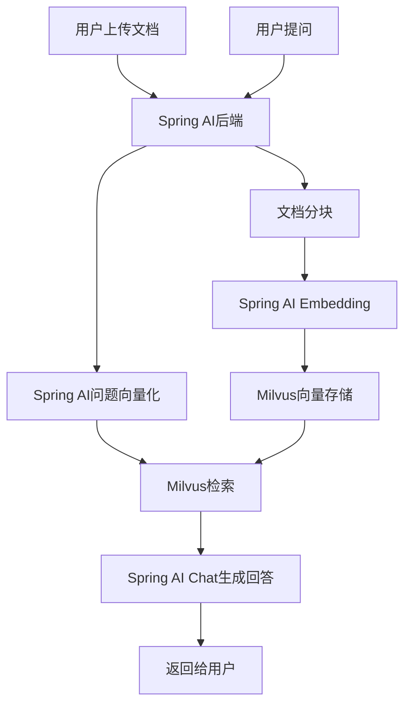

# KnowBase 简化版 - Spring AI + Milvus

## 📋 项目简介

使用Spring AI框架 + Milvus向量数据库实现的RAG系统，代码更简洁，配置更便捷，非常适合期末作业。

## 🏗️ 技术架构



## 🛠️ 环境准备

### 1. 启动Milvus (Docker)
```yaml
# docker-compose.yml-milvus.yml
version: '3.8'
services:
  etcd:
    image: quay.io/coreos/etcd:v3.5.5
    environment:
      - ETCD_AUTO_COMPACTION_MODE=revision
      - ETCD_AUTO_COMPACTION_RETENTION=1000
      - ETCD_QUOTA_BACKEND_BYTES=4294967296
    command: etcd -advertise-client-urls=http://127.0.0.1:2379 -listen-client-urls http://0.0.0.0:2379 --data-dir /etcd
    ports:
      - "2379:2379"

  minio:
    image: minio/minio:RELEASE.2023-03-20T20-16-18Z
    environment:
      MINIO_ACCESS_KEY: minioadmin
      MINIO_SECRET_KEY: minioadmin
    command: minio server /minio_data
    ports:
      - "9000:9000"

  milvus:
    image: milvusdb/milvus:v2.5.1
    command: ["milvus", "run", "standalone"]
    environment:
      ETCD_ENDPOINTS: etcd:2379
      MINIO_ADDRESS: minio:9000
    ports:
      - "19530:19530"
    depends_on:
      - "etcd"
      - "minio"


```

### 2. 后端依赖配置

```xml
<!-- Backend/pom.xml -->
<project xmlns="http://maven.apache.org/POM/4.0.0"
         xmlns:xsi="http://www.w3.org/2001/XMLSchema-instance"
         xsi:schemaLocation="http://maven.apache.org/POM/4.0.0 
                             http://maven.apache.org/xsd/maven-4.0.0.xsd">
    <modelVersion>4.0.0</modelVersion>
    
    <groupId>org.example</groupId>
    <artifactId>knowbase-backend</artifactId>
    <version>1.0.0</version>
    <packaging>jar</packaging>

    <properties>
        <maven.compiler.source>17</maven.compiler.source>
        <maven.compiler.target>17</maven.compiler.target>
        <spring.boot.version>3.2.0</spring.boot.version>
        <spring.ai.version>1.0.0-SNAPSHOT</spring.ai.version>
    </properties>

    <!-- 添加Spring AI BOM -->
    <dependencyManagement>
        <dependencies>
            <dependency>
                <groupId>org.springframework.ai</groupId>
                <artifactId>spring-ai-bom</artifactId>
                <version>${spring.ai.version}</version>
                <type>pom</type>
                <scope>import</scope>
            </dependency>
            <dependency>
                <groupId>org.springframework.boot</groupId>
                <artifactId>spring-boot-dependencies</artifactId>
                <version>${spring.boot.version}</version>
                <type>pom</type>
                <scope>import</scope>
            </dependency>
        </dependencies>
    </dependencyManagement>

    <!-- 添加Spring快照仓库 -->
    <repositories>
        <repository>
            <id>spring-snapshots</id>
            <name>Spring Snapshots</name>
            <url>https://repo.spring.io/snapshot</url>
            <releases>
                <enabled>false</enabled>
            </releases>
        </repository>
        <repository>
            <id>central-portal-snapshots</id>
            <name>Central Portal Snapshots</name>
            <url>https://central.sonatype.com/repository/maven-snapshots/</url>
            <releases>
                <enabled>false</enabled>
            </releases>
            <snapshots>
                <enabled>true</enabled>
            </snapshots>
        </repository>
    </repositories>

    <dependencies>
        <!-- Spring Boot Web -->
        <dependency>
            <groupId>org.springframework.boot</groupId>
            <artifactId>spring-boot-starter-web</artifactId>
        </dependency>
        
        <!-- Spring AI OpenAI Starter -->
        <dependency>
            <groupId>org.springframework.ai</groupId>
            <artifactId>spring-ai-starter-model-openai</artifactId>
        </dependency>
        
        <!-- Spring AI Milvus Vector Store Starter -->
        <dependency>
            <groupId>org.springframework.ai</groupId>
            <artifactId>spring-ai-starter-vector-store-milvus</artifactId>
        </dependency>
        
        <!-- 文档处理 -->
        <dependency>
            <groupId>org.springframework.ai</groupId>
            <artifactId>spring-ai-tika-document-reader</artifactId>
        </dependency>
    </dependencies>

    <build>
        <plugins>
            <plugin>
                <groupId>org.springframework.boot</groupId>
                <artifactId>spring-boot-maven-plugin</artifactId>
                <version>${spring.boot.version}</version>
            </plugin>
        </plugins>
    </build>
</project>
```

### 3. 配置文件
```yaml
# Backend/src/main/resources/application.yml
spring:
  ai:
    openai:
      api-key: ${OPENAI_API_KEY:your-openai-api-key}
      chat:
        options:
          model: gpt-3.5-turbo
          temperature: 0.7
      embedding:
        options:
          model: text-embedding-3-small
    
    vectorstore:
      milvus:
        client:
          host: localhost
          port: 19530
        database-name: default
        collection-name: document_chunks
        embedding-dimension: 1536
        index-type: IVF_FLAT
        metric-type: COSINE

server:
  port: 8080

logging:
  level:
    org.springframework.ai: DEBUG
```

## 💻 核心代码实现

### 1. 文档服务类（Spring AI简化版）
```java
// Backend/src/main/java/org/example/backend/service/DocumentService.java
@Service
public class DocumentService {
    
    private final VectorStore vectorStore;
    
    public DocumentService(VectorStore vectorStore) {
        this.vectorStore = vectorStore;
    }
    
    public String uploadDocument(MultipartFile file) {
        try {
            // 1. 使用Spring AI读取文档
            Resource resource = new ByteArrayResource(file.getBytes()) {
                @Override
                public String getFilename() {
                    return file.getOriginalFilename();
                }
            };
            
            // 2. 使用Tika文档读取器
            TikaDocumentReader documentReader = new TikaDocumentReader(resource);
            List<Document> documents = documentReader.get();
            
            // 3. 文档分块
            TokenTextSplitter textSplitter = new TokenTextSplitter(500, 100, 5, 10000, true);
            List<Document> chunks = textSplitter.apply(documents);
            
            // 4. 添加元数据
            for (int i = 0; i < chunks.size(); i++) {
                Document chunk = chunks.get(i);
                chunk.getMetadata().put("source", file.getOriginalFilename());
                chunk.getMetadata().put("chunk_index", i);
                chunk.getMetadata().put("upload_time", System.currentTimeMillis());
            }
            
            // 5. 存储到Milvus（Spring AI会自动处理向量化）
            vectorStore.add(chunks);
            
            return String.format("文档 '%s' 上传成功，共处理 %d 个文档块", 
                               file.getOriginalFilename(), chunks.size());
            
        } catch (Exception e) {
            return "文档上传失败: " + e.getMessage();
        }
    }
}
```

### 2. 聊天服务类（Spring AI简化版）
```java
// Backend/src/main/java/org/example/backend/service/ChatService.java
@Service
public class ChatService {
    
    private final VectorStore vectorStore;
    private final ChatClient chatClient;
    
    public ChatService(VectorStore vectorStore, ChatClient.Builder chatClientBuilder) {
        this.vectorStore = vectorStore;
        this.chatClient = chatClientBuilder.build();
    }
    
    public ChatResponse processMessage(String userMessage) {
        try {
            // 1. 使用Spring AI进行向量检索 - 正确的API
            SearchRequest searchRequest = SearchRequest.builder()
                    .query(userMessage)
                    .topK(3)
                    .similarityThreshold(0.6)
                    .build();

            List<Document> similarDocuments = vectorStore.similaritySearch(searchRequest);
            
            // 2. 构建上下文
            String context = similarDocuments.stream()
                .map(Document::getText)  // 使用getText()而不是getContent()
                .collect(Collectors.joining("\n\n"));
            
            // 3. 构建提示词
            String prompt = buildPrompt(userMessage, context);
            
            // 4. 使用Spring AI ChatClient生成回答 - 正确的API
            String answer;
            if (context.trim().isEmpty()) {
                answer = "抱歉，我没有找到相关的文档信息来回答您的问题。请先上传相关文档。";
            } else {
                // 使用ChatClient的正确fluent API
                answer = chatClient.prompt()
                        .user(prompt)
                        .call()
                        .content();
            }
            
            // 5. 提取引用信息
            List<String> references = similarDocuments.stream()
                .map(doc -> {
                    String source = (String) doc.getMetadata().get("source");
                    Integer chunkIndex = (Integer) doc.getMetadata().get("chunk_index");
                    return String.format("%s (片段 %d)", source, chunkIndex + 1);
                })
                .collect(Collectors.toList());
            
            return new ChatResponse(answer, references);
            
        } catch (Exception e) {
            return new ChatResponse("处理您的问题时出现错误: " + e.getMessage(), 
                                   Collections.emptyList());
        }
    }
    
    private String buildPrompt(String question, String context) {
        if (context.trim().isEmpty()) {
            return question;
        }
        
        return String.format("""
            请基于以下上下文信息回答用户的问题。如果上下文中没有相关信息，请说明无法找到相关信息。
            
            上下文信息：
            %s
            
            用户问题：%s
            
            请给出准确、有帮助的回答：
            """, context, question);
    }
}
```

### 3. 控制器类
```java
// Backend/src/main/java/org/example/backend/controller/ChatController.java
@RestController
@RequestMapping("/api")
@CrossOrigin
public class ChatController {
    
    private final ChatService chatService;
    private final DocumentService documentService;
    
    public ChatController(ChatService chatService, DocumentService documentService) {
        this.chatService = chatService;
        this.documentService = documentService;
    }
    
    @PostMapping("/chat/message")
    public ChatResponse sendMessage(@RequestBody ChatRequest request) {
        return chatService.processMessage(request.getMessage());
    }
    
    @PostMapping("/documents/upload")
    public Map<String, String> uploadDocument(@RequestParam("file") MultipartFile file) {
        String result = documentService.uploadDocument(file);
        return Map.of("message", result);
    }
    
    @GetMapping("/health")
    public Map<String, String> health() {
        return Map.of("status", "OK", "service", "KnowBase RAG System");
    }
}
```

### 4. 数据模型
```java
// Backend/src/main/java/org/example/backend/model/ChatRequest.java
public class ChatRequest {
    private String message;
    
    public String getMessage() { return message; }
    public void setMessage(String message) { this.message = message; }
}

// Backend/src/main/java/org/example/backend/model/ChatResponse.java
public class ChatResponse {
    private String answer;
    private List<String> references;
    private long timestamp;
    
    public ChatResponse(String answer, List<String> references) {
        this.answer = answer;
        this.references = references;
        this.timestamp = System.currentTimeMillis();
    }
    
    // getters and setters
    public String getAnswer() { return answer; }
    public void setAnswer(String answer) { this.answer = answer; }
    public List<String> getReferences() { return references; }
    public void setReferences(List<String> references) { this.references = references; }
    public long getTimestamp() { return timestamp; }
    public void setTimestamp(long timestamp) { this.timestamp = timestamp; }
}
```

### 5. 配置类（Spring AI自动配置）
```java
// Backend/src/main/java/org/example/backend/config/AIConfig.java
@Configuration
public class AIConfig {
    
    // Spring AI会自动配置VectorStore和ChatClient
    // 这里可以添加自定义配置（可选）
    
    @Bean
    @ConditionalOnMissingBean
    public TokenTextSplitter tokenTextSplitter() {
        return new TokenTextSplitter(500, 100, 5, 10000, true);
    }
}
```

## 🎨 前端代码（与之前相同）

前端代码保持不变，使用相同的Vue组件：
- `ChatWindow.vue` - 聊天界面
- `DocumentUpload.vue` - 文档上传
- `App.vue` - 主应用

## 🚀 运行步骤

### 1. 启动Milvus
```bash
docker-compose.yml -f docker-compose.yml-milvus.yml up -d
```

### 2. 设置环境变量
```bash
export OPENAI_API_KEY=your-openai-api-key
```

### 3. 启动后端
```bash
cd Backend
./mvnw spring-boot:run
```

### 4. 启动前端
```bash
cd fontback
npm run dev
```

## ✨ Spring AI的优势

### 🎯 大幅简化的代码
- **自动配置** - Spring AI自动配置向量存储和LLM客户端
- **统一接口** - 统一的API接口，易于理解和使用
- **内置优化** - 自动处理重试、限流、错误处理

### 📚 核心特性
- **文档读取器** - 支持PDF、DOC、TXT等多种格式
- **文本分割器** - 智能文档分块
- **向量存储** - 原生支持Milvus
- **聊天客户端** - 简化的LLM调用接口

### 🔧 配置简单
```yaml
# 只需要几行配置就能运行完整的RAG系统
spring:
  ai:
    openai:
      api-key: your-key
    vectorstore:
      milvus:
        client:
          host: localhost
          port: 19530
```

## 🎯 功能演示

### 1. 上传文档
- 支持PDF、DOC、TXT等格式
- 自动分块和向量化
- 存储到Milvus向量数据库

### 2. 智能问答
- 基于向量相似度检索
- 使用OpenAI生成高质量回答
- 显示引用的文档片段

### 3. 完整的RAG流程
```
文档上传 → 自动分块 → 向量化 → 存储Milvus
用户提问 → 向量检索 → 上下文增强 → LLM生成回答
```

## 📝 期末作业亮点

### ✅ 技术先进性
- **Spring AI** - 最新的AI应用开发框架
- **Milvus** - 领先的向量数据库
- **OpenAI** - 最先进的LLM服务

### 🎯 代码质量
- **简洁明了** - Spring AI大幅减少代码量
- **易于理解** - 清晰的业务逻辑
- **配置简单** - 最少的配置实现最大功能

### 🚀 功能完整
- **真正的RAG** - 完整的检索增强生成
- **生产级别** - 可扩展的架构设计
- **用户友好** - 直观的界面操作

## 🔧 Context7 MCP 集成应用

### 📚 实时技术文档获取
使用Context7 MCP工具为知识库添加最新技术文档：

```java
// 可以集成Context7 MCP获取实时技术文档
@Service
public class Context7Service {
    
    public void updateTechDocs() {
        // 获取Spring AI最新文档
        // 获取Milvus最新配置
        // 自动更新知识库内容
    }
}
```

### 🎯 技术栈文档覆盖
- **Spring AI** - 获取最新API和配置示例
- **Milvus** - 获取最新版本配置和最佳实践
- **OpenAI** - 获取最新模型参数和使用指南

这个版本使用Spring AI框架，代码更加简洁优雅，同时保持了完整的RAG功能，非常适合期末作业展示！